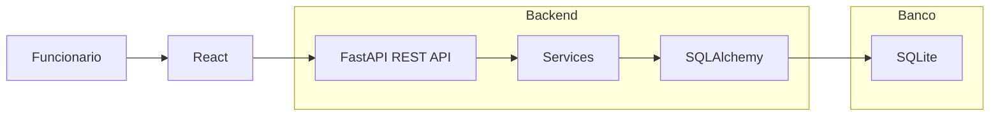
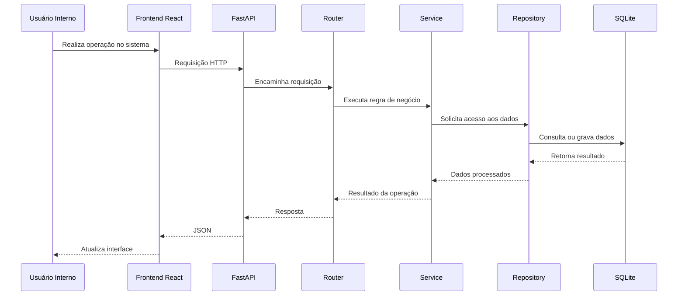

# Documento de Arquitetura do Software

## 🧭 Visão Geral

O Sistema de Gestão de Assistência Técnica segue uma arquitetura em camadas, separando responsabilidades entre interface, lógica de negócio e persistência de dados.

O sistema é utilizado exclusivamente por funcionários internos (administradores e técnicos).

---

# Documento de Projeto Arquitetural do Software

# Arquitetura do Sistema - Assistência Técnica

## Diagrama da Arquitetura

```mermaid
flowchart LR

    FUNCIONARIO["👤 Funcionário (Usuário Interno)"] --> FRONTEND

    subgraph FRONTEND["🖥️ Frontend"]
        REACT["⚛️ React + Vite"]
        ROUTES["🧭 React Router"]
        AXIOS["🔗 Axios"]

        REACT --> ROUTES --> AXIOS
    end

    AXIOS --> API

    subgraph BACKEND["⚙️ Backend - FastAPI"]
        UVICORN["🚀 Uvicorn Server"]
        FASTAPI["⚡ FastAPI"]

        subgraph MIDDLEWARE["🔧 Middleware"]
            CORS["CORS"]
            LOG["Logs"]
            ERROR["Tratamento de Erros"]
        end

        subgraph ROUTERS["🗺️ Router Layer"]
            AUTH["/auth"]
            CLIENTES["/clientes"]
            FUNCIONARIOS["/funcionarios"]
            EQUIPAMENTOS["/equipamentos"]
            ORDEM_SERVICOS["/ordens-servico"]
            SERVICOS["/servicos-executados"]
            PECAS["/equipamentos-usados"]
            CONTAS["/contas-receber"]
            NOTIFICACOES["/notificacoes"]
            RELATORIOS["/relatorios"]
        end

        subgraph SERVICES["📦 Service Layer"]
            AUTH_SERVICE["Auth Service"]
            CLIENTE_SERVICE["Cliente Service"]
            FUNC_SERVICE["Funcionario Service"]
            OS_SERVICE["OrdemServico Service"]
            FIN_SERVICE["Financeiro Service"]
        end

        subgraph REPOSITORIES["🗄️ Repository Layer"]
            CLIENTE_REPO["Cliente Repository"]
            FUNC_REPO["Funcionario Repository"]
            OS_REPO["OrdemServico Repository"]
            FIN_REPO["ContaReceber Repository"]
        end

        subgraph MODELS["🗃️ Model Layer (SQLAlchemy)"]
            CLIENTE["Cliente"]
            FUNCIONARIO["Funcionario"]
            EQUIPAMENTO["Equipamento"]
            ORDEM["OrdemServico"]
            SERVICO["ServicoExecutado"]
            PECA["EquipamentoUsado"]
            CONTA["ContaReceber"]
            NOTIF["Notificacao"]
        end

        UVICORN --> FASTAPI
        FASTAPI --> MIDDLEWARE
        MIDDLEWARE --> ROUTERS
        ROUTERS --> SERVICES
        SERVICES --> REPOSITORIES
        REPOSITORIES --> MODELS
    end

    subgraph DATABASE["💾 Banco de Dados"]
        DB["SQLite"]
    end

    MODELS --> DB
```

---

# Descrição dos Componentes

## 1. Usuário Interno

O sistema é utilizado exclusivamente por funcionários autorizados da assistência técnica, como administradores e técnicos. Os clientes não possuem acesso direto à aplicação.

| Componente   | Descrição                                                                                   |
| ------------ | ------------------------------------------------------------------------------------------- |
| React        | Biblioteca responsável pela construção da interface                                         |
| Vite         | Ferramenta de desenvolvimento e build                                                       |
| React Router | Gerenciamento das rotas da aplicação                                                        |
| Axios        | Comunicação com a API REST                                                                  |
| Componentes  | Elementos reutilizáveis da interface                                                        |
| Páginas      | Dashboard, Clientes, Equipamentos, Funcionários, Ordens de Serviço, Financeiro e Relatórios |
| Vitest       | Testes unitários e de integração do frontend                                                |

---

## 2. BACKEND - SERVIDOR 

| Camada           | Componente                      | Descrição                                    |
| ---------------- | ------------------------------- | -------------------------------------------- |
| Servidor ASGI    | Uvicorn                         | Responsável por executar a aplicação FastAPI |
| Framework        | FastAPI                         | Criação da API REST                          |
| Middleware       | CORS, Logs, Tratamento de Erros | Processamento das requisições                |
| Router Layer     | Routers                         | Recebem e direcionam requisições HTTP        |
| Service Layer    | Services                        | Implementam regras de negócio                |
| Repository Layer | Repositories                    | Isolam o acesso aos dados                    |
| Model Layer      | SQLAlchemy ORM                  | Representação das entidades do sistema       |
| Schema Layer     | Pydantic                        | Validação e serialização dos dados           |
| Testes           | Pytest                          | Testes unitários e integração                |

---

## 3. BANCO DE DADOS (SQLite)

| Componente      | Descrição                                                    |
| --------------- | ------------------------------------------------------------ |
| database.sqlite | Arquivo responsável pelo armazenamento dos dados             |
| SQLAlchemy      | Camada ORM utilizada para acesso ao banco                    |
| SQLite          | Sistema Gerenciador de Banco de Dados utilizado pelo projeto |

---

## Fluxo de Dados

O Sistema de Gestão de Assistência Técnica utiliza uma arquitetura em camadas para garantir a separação de responsabilidades entre a interface do usuário, a lógica de negócio e a persistência de dados.

Toda interação segue o fluxo abaixo:

## Descrição do Fluxo

1. Um funcionário autorizado (administrador ou técnico) realiza uma ação na interface do sistema.
2. O frontend React processa a ação e envia uma requisição HTTP para a API.
3. O FastAPI recebe a requisição e encaminha para o Router correspondente.
4. O Router direciona a solicitação para o Service responsável.
5. O Service executa as regras de negócio da aplicação.
6. Quando necessário, o Service utiliza o Repository para acessar os dados.
7. O Repository realiza consultas, inserções, atualizações ou exclusões no banco de dados utilizando os Models definidos com SQLAlchemy.
8. O banco de dados SQLite processa a operação e retorna os resultados ao Repository.
9. O Repository devolve os dados ao Service para tratamento e preparação da resposta.
10. O Service retorna o resultado ao Router, que o encaminha ao FastAPI.
11. O FastAPI gera uma resposta em formato JSON e a envia ao frontend.
12. O frontend recebe os dados e atualiza a interface apresentada ao funcionário.

### Exemplo: Cadastro de Cliente

1. O funcionário acessa a tela de cadastro de clientes.
2. O formulário é preenchido com os dados do cliente.
3. O React realiza validações básicas dos campos.
4. O Axios envia uma requisição POST para /api/clientes.
5. O FastAPI recebe a requisição e a encaminha para o serviço responsável.
6. O Service valida as regras de negócio.
7. O Repository utiliza o SQLAlchemy para persistir os dados no SQLite.
8. O banco retorna a confirmação da operação.
9. A API responde com status HTTP 201 (Created).
10. O frontend atualiza a listagem de clientes.

### Exemplo: Abertura de Ordem de Serviço

1. O funcionário seleciona o cliente e o equipamento.
2. O técnico responsável é definido.
3. Os dados da ordem de serviço são informados.
4. O frontend envia uma requisição para a API.
5. O Service valida as informações recebidas.
6. O Repository registra a Ordem de Serviço no banco de dados.
7. O sistema pode gerar automaticamente uma Conta a Receber vinculada à OS.
8. Uma notificação pode ser criada para acompanhamento do serviço.
9. A API retorna os dados da nova ordem de serviço.
10. O frontend atualiza a interface com as informações cadastradas.