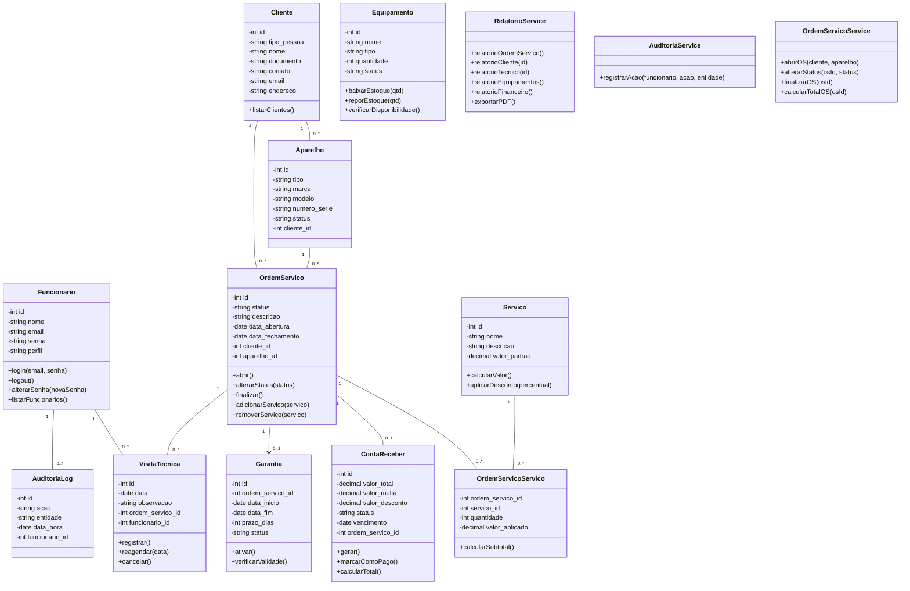

# Modelo de Dados

## 📊 Diagrama de Classes usando Mermaid



### Descrição das Entidades

Entidade |	Descrição   |
---------| ------------ |
| **Funcionario** | Entidade que representa os colaboradores internos do sistema (técnicos e administradores). Contém os dados: id, nome, email, senha e perfil (admin ou técnico). Responsável pela execução de atividades operacionais do sistema. Possui os métodos: login(email, senha), logout(), alterarSenha(novaSenha).|
| **Cliente** | Entidade que representa os clientes da assistência técnica. Armazena informações cadastrais como nome, documento, contato, email e endereço. Não possui acesso ou autenticação no sistema.|
| **Aparelho** | Entidade que representa os equipamentos pertencentes aos clientes (celular, notebook, computador, entre outros). Contém informações como tipo, marca, modelo, número de série, status e cliente associado.|
| **Ordem_Servico** | Entidade central do sistema, responsável por representar um atendimento técnico. Contém informações da OS e controla todo o fluxo de atendimento. Possui os métodos: abrir(), alterarStatus(status), finalizar(), calcularTotal(), adicionarServico(servico), removerServico(servico).|
| **Servico** | Entidade que representa os serviços oferecidos pela assistência técnica, como formatação e troca de peças. Contém nome, descrição e valor padrão. Possui os métodos: calcularValor(), aplicarDesconto(percentual).|
| **Ordem_Servico_Servico** | Entidade associativa que relaciona ordens de serviço e serviços executados, permitindo múltiplos serviços por OS. Contém ordem_servico_id, servico_id, quantidade e valor aplicado. Possui o método: calcularSubtotal().|
| **Equipamento** | Entidade que representa ferramentas, peças e insumos utilizados no processo de manutenção técnica. Contém nome, tipo, quantidade em estoque e status. Possui os métodos: baixarEstoque(qtd), reporEstoque(qtd), verificarDisponibilidade().|
| **Visita_Tecnica** | Entidade que registra visitas técnicas realizadas pelos funcionários vinculadas a uma ordem de serviço. Contém data, observação, ordem_servico_id e funcionario_id. Possui os métodos: registrar(), reagendar(data), cancelar().|
| **Conta_Receber** | Entidade financeira responsável pelo controle dos valores a receber gerados pelas ordens de serviço. Contém valor_total, status, vencimento e OS relacionada. Possui os métodos: gerar(), marcarComoPago(), calcularTotal().|
| **Garantia** | Entidade responsável pela garantia do sreviço prestado. Contém id, ordem_servico_id, data_inicio, data_fim, prazo_dias, status. Possui os métodos: ativar() e verificarValidade().
| **Auditoria_Log** | Entidade responsável pelo registro de ações executadas no sistema. Contém funcionario_id, ação, entidade afetada e data/hora.|
| **Relatorio_Service**| Serviço responsável pela geração de relatórios do sistema, realizando consultas e consolidação de dados para fins gerenciais e operacionais. Possui os métodos: listarClientes(), listarFuncionarios(), relatorioOS(), relatorioCliente(id), relatorioTecnico(id), relatorioEquipamentos(), relatorioFinanceiro(), exportarPDF(). |
| **AuditoriaService**|	Responsável por registrar ações executadas no sistema, criando logs de auditoria para rastreabilidade das operações realizadas por funcionários. Possui o método: registrarAcao(funcionario, acao, entidade).|
| **OrdemServicoService**|	Responsável pela lógica de negócio das Ordens de Serviço, incluindo abertura, alteração de status, finalização e cálculo de valores totais. |

---

## Diagrama Entidade-Relacionamento

```mermaid
erDiagram 

class Funcionario {
    int id PK
    string nome
    string email
    string senha
    string perfil   
}

class Cliente {
    int id PK
    string tipo_pessoa
    string nome
    string documento
    string contato
    string email
    string endereco
}

class Aparelho {
    int id PK
    string tipo
    string marca
    string modelo
    string numero_serie
    string status
    int cliente_id FK
}

class Ordem_Servico {
    int id PK
    string status
    string descricao
    date data_abertura
    date data_fechamento
    int cliente_id FK
    int aparelho_id FK
}

class Servico {
    int id PK
    string nome
    string descricao
    decimal valor_padrao
}

class OrdemServicoServico {
    int ordem_servico_id FK
    int servico_id FK
    int quantidade
    decimal valor_aplicado
}

class Equipamento {
    int id PK
    string nome
    string tipo
    int quantidade
    string status
}

class VisitaTecnica {
    int id PK
    date data
    string observacao
    int ordem_servico_id FK
    int funcionario_id FK
}

class ContaReceber {
    int id PK
    decimal valor_total
    decimal valor_multa
    decimal valor_desconto
    string status
    date vencimento
    int ordem_servico_id FK
}

class Garantia {
  int id PK
  int ordem_servico_id FK
  date data_inicio
  date data_fim
  int prazo_dias
  string status  
}

class AuditoriaLog {
    int id PK
    string acao
    string entidade
    date data_hora
    int funcionario_id FK
} 
```

### Dicionário de Dados

|   Tabela   | FUNCIONARIO |
| ---------- | ----------- |
| Descrição  | Armazena as informações gerais dos funcionários da assistência técnica, responsáveis pela execução das atividades operacionais e administrativas da assistência técnica. |
| Observação | Funcionários podem ser técnico ou administrativo. |

|  Nome  | Descrição                          | Tipo de Dado | Restrições de Domínio  |
| ------ | ---------------------------------- | ------------ | ---------------------- |
| id     | Identificador único do funcionário | INT          | PK / Auto Increment    |
| nome   | Nome completo do funcionário       | VARCHAR(150) | NOT NULL               |
| email  | E-mail de acesso ao sistema        | VARCHAR(150) | NOT NULL / UNIQUE      |
| senha  | Senha criptografada                | VARCHAR(255) | NOT NULL               |
| perfil | Tipo de acesso (admin ou técnico)  | VARCHAR(20)  | CHECK (admin, tecnico) |

---

|   Tabela   | CLIENTE |
| ---------- | ----------- |
| Descrição  | Armazena as informações cadastrais dos clientes que utilizam os serviços da assistência técnica. |
| Observação | Clientes não possuem acesso ao sistema, sendo apenas registrados para controle de atendimentos e ordens de serviço. |

|  Nome       | Descrição                                          | Tipo de Dado | Restrições  |
| ------------| ---------------------------------------------------| ------------ | ------------------- |
| id          | Identificador único do cliente                     | INT          | PK / Auto Increment |
| tipo_pessoa | Tipo do cliente (Pessoa Física ou Pessoa Jurídica) | VARCHAR(2)   | CHECK ('PF','PJ')   |
| nome        | Nome ou razão social                               | VARCHAR(150) | NOT NULL            |
| documento   | CPF ou CNPJ do cliente                             | VARCHAR(18)  | NOT NULL / UNIQUE   |
| contato     | Telefone de contato                                | VARCHAR(20)  | NULL                |
| email       | E-mail do cliente                                  | VARCHAR(150) | NULL                |
| endereco    | Endereço completo                                  | VARCHAR(200) | NULL                |

---

|   Tabela   | APARELHO |
| ---------- | ----------- |
| Descrição  | Representa os dispositivos pertencentes aos clientes que são submetidos a manutenção ou análise técnica. |
| Observação | Um cliente pode possuir vários aparelhos. O aparelho é vinculado a uma ou mais Ordens de Serviço ao longo do tempo. |

|  Nome        | Descrição                       | Tipo de Dado | Restrições       |
| ------------ | ------------------------------- | ------------ | ---------------- |
| id           | Identificador único do aparelho | INT          | PK               |
| tipo         | Tipo (celular, notebook, etc.)  | VARCHAR(30)  | NOT NULL         |
| marca        | Marca do aparelho               | VARCHAR(30)  | NULL             |
| modelo       | Modelo do aparelho              | VARCHAR(30)  | NULL             |
| numero_serie | Número de série                 | VARCHAR(50)  | UNIQUE           |
| status       | Status do aparelho              | VARCHAR(20)  | DEFAULT 'ATIVO'  |
| cliente_id   | Cliente proprietário            | INT          | FK → CLIENTE(id) |

---

|   Tabela   | ORDEM_SERVICO     |
| ---------- | ----------------- |
| Descrição  | Representa o atendimento técnico realizado pela assistência, sendo a entidade central do sistema que controla todo o fluxo de execução do serviço.|
| Observação | Cada ordem de serviço está vinculada a um cliente e a um aparelho, podendo conter múltiplos serviços executados e gerar automaticamente uma conta a receber ao ser finalizada.|

|  Nome           | Descrição             | Tipo        | Restrições de Domínio                               |
| --------------- | --------------------- | ----------- | --------------------------------------------------- |
| id              | Identificador da OS   | INT         | PK                                                  |
| status          | Status da OS          | VARCHAR(20) | CHECK (ABERTA, EM_ANDAMENTO, FINALIZADA, CANCELADA) |
| descricao       | Descrição do problema | TEXT        | NOT NULL                                            |
| data_abertura   | Data de abertura      | DATE        | DEFAULT CURRENT_DATE                                |
| data_fechamento | Data de fechamento    | DATE        | NULL                                                |
| cliente_id      | Cliente da OS         | INT         | FK → CLIENTE(id)                                    |
| aparelho_id     | Aparelho da OS        | INT         | FK → APARELHO(id)                                   |

---

|   Tabela   |  SERVICO    |
| ---------- | ----------- |
| Descrição	 | Catálogo de serviços oferecidos pela assistência técnica. |
| Observação | Os serviços possuem valor padrão, que pode ser ajustado no momento da execução conforme condições específicas do atendimento. |

|  Nome        | Descrição                | Tipo de Dado  | Restrições        |
| ------------ | ------------------------ | ------------- | ----------------- |
| id           | Identificador do serviço | INT           | PK                |
| nome         | Nome do serviço          | VARCHAR(100)  | NOT NULL / UNIQUE |
| descricao    | Descrição do serviço     | TEXT          | NULL              |
| valor_padrao | Valor base do serviço    | DECIMAL(10,2) | NOT NULL          |

---

|   Tabela   | ORDEM_SERVICO_SERVICO |
| ---------- | --------------------- |
| Descrição  | Tabela associativa que registra quais serviços foram executados em cada ordem de serviço, permitindo detalhamento e controle das execuções.|
| Observação | Permite o relacionamento N:N entre ordens de serviço e serviços, armazenando também quantidade e valor efetivamente cobrado.|

| Nome             | Descrição             | Tipo          | Restrições |
| ---------------- | --------------------- | ------------- | ---------- |
| ordem_servico_id | OS relacionada        | INT           | FK         |
| servico_id       | Serviço executado     | INT           | FK         |
| quantidade       | Quantidade do serviço | INT           | DEFAULT 1  |
| valor_aplicado   | Valor cobrado         | DECIMAL(10,2) | NOT NULL   |

---

|   Tabela   | EQUIPAMENTO |
| ---------- | ----------- |
| Descrição  | Representa os itens de estoque utilizados na execução dos serviços, incluindo peças, ferramentas e insumos da assistência técnica. |
| Observação | Um equipamento pode ser utilizado em múltiplas ordens de serviço, sendo controlado pelo sistema de estoque.|

|  Nome      | Descrição                     | Tipo de Dado | Restrições de Domínio     |
| ---------- | ----------------------------- | ------------ | ------------------------- |
| id         | Identificador                 | INT          | PK                        |
| nome       | Nome do equipamento           | VARCHAR(100) | NOT NULL                  |
| tipo       | Tipo (peça, ferramenta, etc.) | VARCHAR(30)  | NOT NULL                  |
| quantidade | Estoque disponível            | INT          | DEFAULT 0                 |
| status     | Situação do item              | VARCHAR(20)  | CHECK (ATIVO, DESATIVADO) |

---

|   Tabela   | VISITA_TECNICA |
| ---------- | -------------- |
| Descrição  | Vinculada a uma OS, registra agendamentos e realizações de atendimentos presenciais. |
| Observação | A visita só pode ser atribuída a um técnico válido. Permite reagendamento e cancelamento. |

|  Nome            | Descrição           | Tipo     | Restrições |
| ---------------- | ------------------- | -------- | ---------- |
| id               | Identificador       | INT      | PK         |
| data             | Data da visita      | DATETIME | NOT NULL   |
| observacao       | Observações         | TEXT     | NULL       |
| ordem_servico_id | OS vinculada        | INT      | FK         |
| funcionario_id   | Técnico responsável | INT      | FK         |

---

|   Tabela   | CONTA_RECEBER |
| ---------- | ------------- |
| Descrição  | Representa os valores financeiros gerados pelas ordens de serviço, sendo responsável pelo controle de cobrança dos clientes.|
| Observação |A conta a receber é gerada automaticamente ao final da ordem de serviço e pode sofrer alterações como multa, desconto e atualização de status de pagamento.|

|  Nome            | Descrição               | Tipo de Dado  |  Restrições de Domínio          |
| ---------------- | ----------------------- | ------------- | ------------------------------- |
| id               | Identificador           | INT           | PK                              |
| valor_total      | Valor total da cobrança | DECIMAL(10,2) | NOT NULL                        |
| valor_multa      | Multa aplicada          | DECIMAL(10,2) | DEFAULT 0                       |
| valor_desconto   | Desconto aplicado       | DECIMAL(10,2) | DEFAULT 0                       |
| status           | Status do pagamento     | VARCHAR(20)   | CHECK (PENDENTE, PAGO, VENCIDO) |
| vencimento       | Data de vencimento      | DATE          | NOT NULL                        |
| ordem_servico_id | OS vinculada            | INT           | FK                              |

---

| Tabela     | GARANTIA                       |
| ---------- | ------------------------------ |
| Descrição  | Armazena as informações da garantia gerada a partir da finalização de uma Ordem de Serviço, definindo o período de cobertura dos serviços realizados. |
| Observação | Cada Ordem de Serviço pode gerar no máximo uma garantia. A garantia controla o período em que o serviço pode ser reexecutado sem custos adicionais. |

| Nome             | Descrição                                   | Tipo de Dado | Restrições de Domínio              |
| ---------------- | ------------------------------------------- | ------------ | ---------------------------------- |
| id               | Identificador único da garantia             | INT          | PK / Auto Increment                |
| ordem_servico_id | Referência à Ordem de Serviço vinculada     | INT          | FK / NOT NULL / UNIQUE             |
| data_inicio      | Data de início da garantia                  | DATE         | NOT NULL                           |
| data_fim         | Data de término da garantia                 | DATE         | NOT NULL                           |
| prazo_dias       | Duração da garantia em dias                 | INT          | NOT NULL / > 0                     |
| cobertura        | Descrição do que está coberto pela garantia | VARCHAR(255) | NULL                               |
| status           | Situação da garantia                        | VARCHAR(20)  | CHECK (ativa, expirada, cancelada) |

---

|   Tabela   | AUDITORIA_LOG |
| ---------- | ------------- |
| Descrição  | Registra todas as ações realizadas no sistema pelos funcionários, garantindo rastreabilidade e segurança das operações.|
| Observação | Os registros são imutáveis e servem para auditoria, controle de alterações e análise de histórico de ações no sistema. |

| Nome           | Descrição                             | Tipo        |  Restrições de Domínio    |
| -------------- | ------------------------------------- | ----------- | ------------------------- |
| id             | Identificador                         | INT         | PK                        |
| acao           | Tipo de ação (INSERT, UPDATE, DELETE) | VARCHAR(20) | NOT NULL                  |
| entidade       | Tabela afetada                        | VARCHAR(50) | NOT NULL                  |
| funcionario_id | Funcionário responsável               | INT         | FK                        |
| data_hora      | Data da ação                          | DATETIME    | DEFAULT CURRENT_TIMESTAMP |

---