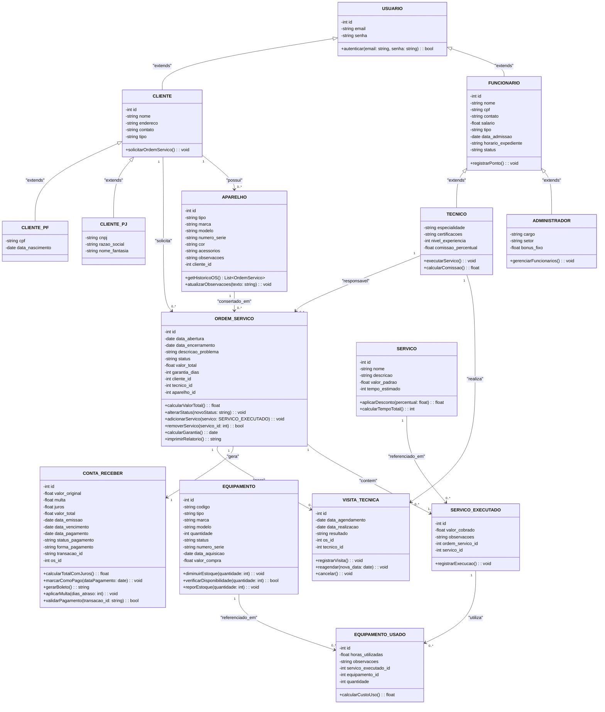
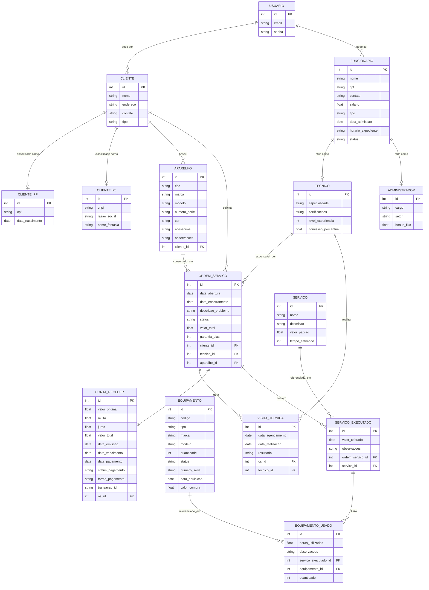

# Modelo de Dados

## 📊 Diagrama de Classes usando Mermaid

### Descrição das Entidades

Entidade                          |	Descrição   |
---------                         | ----------- |
Usuário	   | Entidade base abstrata para representar informações gerais de acesso ao sistema: id, email, senha. Possui o método +autenticar(email, senha) para validação de credenciais. |
Cliente	   | Entidade que representa um cliente do sistema, estendendo USUARIO. Contém informações cadastrais: nome, endereco, contato, tipo (PF/PJ). Possui o método +solicitarOrdemServico() para abertura de novas ordens de serviço. |
Cliente CPF	| Especialização de CLIENTE para pessoa física. Adiciona os atributos cpf e data_nascimento. |
Cliente CNPJ	| Especialização de CLIENTE para pessoa jurídica. Adiciona os atributos cnpj, razao_social e nome_fantasia. |
Funcionário	 | Entidade que representa um funcionário da assistência técnica, estendendo USUARIO. Contém dados como nome, cpf, contato, salario, tipo, data_admissao, horario_expediente e status. Possui o método +registrarPonto() para controle de jornada. |
Técnico | Especialização de FUNCIONARIO para técnicos especializados. Adiciona especialidade, certificacoes, nivel_experiencia e comissao_percentual. Possui os métodos +executarServico() e +calcularComissao() para gestão de serviços e remuneração variável.|
Administrador | Especialização de FUNCIONARIO para administradores do sistema. Adiciona cargo, setor e bonus_fixo. Possui o método +gerenciarFuncionarios() para administração da equipe. |
Aparelho  | Entidade que representa os equipamentos dos clientes que serão reparados. Contém informações técnicas: tipo, marca, modelo, numero_serie, cor, acessorios, observacoes e cliente_id. Possui os métodos +getHistoricoOS() para consultar todas as ordens de serviço do aparelho e +atualizarObservacoes() para manutenção do registro. |
Ordem de Serviço | Entidade central que representa uma ordem de serviço aberta para reparo. Contém data_abertura, data_encerramento, descricao_problema, status, valor_total, garantia_dias, cliente_id, tecnico_id e aparelho_id. Possui métodos para +calcularValorTotal(), +alterarStatus(), +adicionarServico(), +removerServico(), +calcularGarantia() e +imprimirRelatorio(). |
Serviço | Entidade que representa um tipo de serviço oferecido pela assistência (ex: limpeza, troca de tela, reparo de placa). Contém nome, descricao, valor_padrao e tempo_estimado. Possui métodos para +aplicarDesconto() e +calcularTempoTotal(). |
Serviço_executado | Entidade associativa que registra a execução de um serviço específico em uma ordem de serviço. Contém valor_cobrado (que pode ser diferente do valor padrão), observacoes, ordem_servico_id e servico_id. Possui o método +registrarExecucao() para formalizar a realização do serviço. |
Equipamento	| Entidade que representa insumos, ferramentas ou peças do estoque da assistência. Contém codigo, tipo, marca, modelo, quantidade, status, numero_serie, data_aquisicao e valor_compra. Possui métodos para +diminuirEstoque(), +verificarDisponibilidade() e +reporEstoque() para controle de inventário. |
Equipamento_usado | Entidade associativa que registra quais equipamentos/peças foram consumidos ou utilizados em cada serviço executado. Contém horas_utilizadas, observacoes, servico_executado_id, equipamento_id e quantidade. Possui o método +calcularCustoUso() para apurar o custo dos insumos aplicados. |
Visita Técnica | Entidade que representa visitas realizadas por técnicos na residência do cliente. Contém data_agendamento, data_realizacao, resultado, os_id e tecnico_id. Possui métodos para +registrarVisita(), +reagendar() e +cancelar() para gestão do atendimento externo. |
Conta a Receber	| Entidade que representa as obrigações financeiras geradas pelas ordens de serviço. Contém valor_original, multa, juros, valor_total, data_emissao, data_vencimento, data_pagamento, status_pagamento, forma_pagamento, transacao_id e os_id. Possui métodos para +calcularTotalComJuros(), +marcarComoPago(), +gerarBoleto(), +aplicarMulta() e +validarPagamento() para gestão financeira completa. |

---

## Modelo de Dados (Entidade-Relacionamento) usando Mermaid

### Dicionário de Dados

|   Tabela   | USUARIO |
| ---------- | ----------- |
| Descrição  | Armazena as credenciais de autenticação dos usuários do sistema. |
| Observação | É uma entidade abstrata/base para autenticação. Um usuário pode ser cliente e/ou funcionário, conforme as regras de negócio. |

|  Nome         | Descrição                        | Tipo de Dado | Tamanho | Restrições de Domínio |
| ------------- | -------------------------------- | ------------ | ------- | --------------------- |
| id | Identificador único | SERIAL | --- | PK / Identity |
| e-mail | e-mail para login  | VARCHAR | 150 | Unique / Not Null |
| senha  | Senha criptografada | VARCHAR | 255 | Not Null |

---

|   Tabela   | CLIENTE |
| ---------- | ----------- |
| Descrição  | Armazena as informações gerais dos clientes da assistência técnica. |
| Observação | Clientes podem ser Pessoa Física (PF) ou Pessoa Jurídica (PJ). A diferenciação é feita pelo campo classificado, com dados complementares armazenados nas tabelas Cliente_PF e Cliente_PJ. |

|  Nome         | Descrição                        | Tipo de Dado | Tamanho | Restrições de Domínio |
| ------------- | -------------------------------- | ------------ | ------- | --------------------- |
| id | Identificador único(FK para USUARIO) | INT | --- | PK / FK (USUARIO.id) |
| nome | Nome completo do cliente (PF) ou razão social (PJ) | VARCHAR | 150 | Not Null |
| endereco  | Endereço completo do cliente | VARCHAR | 200 | --- |
| contato | Telefone para contato | VARCHAR | 20 | --- |
| tipo | Classificação do cliente (PF ou PJ) | VARCHAR | 2 | CHECK (tipo IN ('PF','PJ')) / NOT NULL |

|   Tabela   | CLIENTE_PF |
| ---------- | ----------- |
| Descrição  | Armazena informações específicas de clientes do tipo Pessoa Física. |
| Observação | Todo cliente PF deve ter um registro correspondente na tabela Cliente.|

|  Nome         | Descrição                        | Tipo de Dado | Tamanho | Restrições de Domínio |
| ------------- | -------------------------------- | ------------ | ------- | --------------------- |
| id | Identificador único(FK para CLIENTE) | INT | --- | PK / FK |
| cpf | Cadastro de Pessoa Física | VARCHAR | 14 | Unique / Not Null |
| data_nascimento  | Data de nascimento do cliente | DATE | --- | Not Null |

|   Tabela   | CLIENTE_PJ |
| ---------- | ----------- |
| Descrição  | Armazena informações específicas de clientes do tipo Pessoa Jurítica. |
| Observação | Todo cliente PJ deve ter um registro correspondente na tabela Cliente.|

|  Nome         | Descrição                        | Tipo de Dado | Tamanho | Restrições de Domínio |
| ------------- | -------------------------------- | ------------ | ------- | --------------------- |
| id | Identificador único(FK para CLIENTE) | INT | --- | PK / FK |
| cnpj | Cadastro Nacional da Pessoa Jurídica | VARCHAR | 18 | Unique / Not Null |
| razao_social  | Razão social da empresa | VARCHAR | 150 | Not Null |
| nome_fantasia | Nome fantasia da empresa | VARCHAR | 100 | --- |

---

|   Tabela   | FUNCIONARIO |
| ---------- | ----------- |
| Descrição  | Armazena as informações gerais dos funcionários da assistência técnica. |
| Observação | Funcionários podem ser técnico ou administrativo. A diferenciação é feita pelo campo classificado, com dados complementares armazenados nas tabelas Técnico e Administrador. |

|  Nome         | Descrição                        | Tipo de Dado | Tamanho | Restrições de Domínio |
| ------------- | -------------------------------- | ------------ | ------- | --------------------- |
| id | Identificador único(FK para USUARIO) | INT | --- | PK / FK (USUARIO.id) |
| nome | Nome completo do Funcionário  | VARCHAR | 150 | Not Null |
| cpf |	Cadastro de Pessoa Física |	VARCHAR | 14 | Unique / Not Null |
| contato | Telefone para contato | VARCHAR | 20 | --- |
| salario |	Salário base do funcionário | DECIMAL(10,2) | --- |	NOT NULL / CHECK (salario >= 0) |
| tipo | Classificação do funcionário (técnico ou administrativo) | VARCHAR | 15 | CHECK (tipo IN ('TECNICO','ADMINISTRADOR')) / Not Null |
| data_admissao	| Data de contratação |	DATE | --- | Not Null |
| horario_expediente | Horário de trabalho | VARCHAR | 50 |	--- |
| status |	Situação do funcionário	| VARCHAR |	10	| CHECK (status IN ('ATIVO','FERIAS','AFASTADO','DESATIVADO')) / DEFAULT 'ATIVO' |

|   Tabela   | TECNICO |
| ---------- | ----------- |
| Descrição  | Responsável pela execução de Ordens de Serviço e Visitas Técnicas. Armazena dados específicos como especialidade, certificações, nível de experiência e comissão percentual. |
| Observação | Especialização da tabela FUNCIONARIO. Todo técnico deve ter um registro correspondente na tabela FUNCIONARIO com tipo = 'TECNICO'. |

|  Nome         | Descrição                        | Tipo de Dado | Tamanho | Restrições de Domínio |
| ------------- | -------------------------------- | ------------ | ------- | --------------------- |
| id | Identificador único(FK para FUNCIONARIO) | INT | --- | PK / FK |
| especialidade | Área de atuação principal | VARCHAR | 100 | Not Null |
| certificacoes  | Certificações técnicas (formato JSON ou texto) | TEXT| --- | --- |
| nivel_experiencia | Nível hierárquico (1-5) | INT | --- | CHECK (nivel_experiencia BETWEEN 1 AND 5) |
|comissao_percentual | Percentual de comissão sobre serviços | DECIMAL(5,2) | --- |	DEFAULT 0.00, CHECK (comissao_percentual >= 0) |

|   Tabela   | ADMINISTRADOR |
| ---------- | ----------- |
| Descrição  | Responsável pela gestão, emissão de contas, cadastro de clientes etc. |
| Observação | Especialização da tabela FUNCIONARIO. Todo administrador deve ter um registro correspondente na tabela FUNCIONARIO com tipo = 'ADMINISTRADOR'. |

|  Nome         | Descrição                        | Tipo de Dado | Tamanho | Restrições de Domínio |
| ------------- | -------------------------------- | ------------ | ------- | --------------------- |
| id | Identificador único(FK para FUNCIONARIO) | INT | --- | PK / FK |
| cargo | Cargo administrativo | VARCHAR | 80 | Not Null |
| setor | Nível hierárquico (1-5) | INT | --- | CHECK (nivel_experiencia BETWEEN 1 AND 5) |
|bonus_fixo | Bônus mensal fixo | DECIMAL(10,2) | --- |	DEFAULT 0.00 / CHECK (bonus_fixo >= 0) |

---

|   Tabela   | APARELHO |
| ---------- | ----------- |
| Descrição  | Representa os equipamentos dos clientes que serão reparados. |
| Observação | Um cliente pode possuir vários aparelhos. O aparelho é vinculado a uma ou mais Ordens de Serviço ao longo do tempo. |

|  Nome         | Descrição                        | Tipo de Dado | Tamanho | Restrições de Domínio |
| ------------- | -------------------------------- | ------------ | ------- | --------------------- |
| id | Identificador único | SERIAL / INT | --- | PK / Identity |
| tipo  | Tipo/categoria do aparelho (celular, notebook, tablet, etc.) | VARCHAR | 30 | NOT NULL |
| marca | Marca do aparelho | VARCHAR | 20 |	--- |
| modelo | Modelo do aparelho | VARCHAR | 20 | --- |
| numero_serie | numero_serie | VARCHAR | 50 | UNIQUE |
| cor | Cor do aparelho | VARCHAR |	30 | --- |
| acessorios | Acessórios que acompanham o aparelho	| TEXT | --- | --- |
| observacoes |	Observações adicionais sobre o aparelho | TEXT | --- | --- |
| cliente_id | Referência ao cliente proprietário |	INT	| --- |	FK (CLIENTE.id) / NOT NULL |

---

|   Tabela   | ORDEM_SERVICO |
| ---------- | ----------- |
| Descrição  | Núcleo do sistema. Registra cada solicitação de serviço, seu status, valor total, datas de abertura e encerramento, além de vincular cliente solicitante e técnico responsável. |
| Observação | Uma OS é aberta para cada atendimento solicitado. Ao ser finalizada, gera automaticamente uma CONTA_RECEBER. |

|  Nome         | Descrição                        | Tipo de Dado | Tamanho | Restrições de Domínio |
| ------------- | -------------------------------- | ------------ | ------- | --------------------- |
| id | Identificador único da OS | SERIAL / INT | --- | PK / Identity |
| data_abertura | Data de criação da Ordem de Serviço  | DATE | --- | NOT NULL / DEFAULT CURRENT_DATE |
| data_encerramento  | Data de conclusão do serviço | DATE | --- | --- |
| descricao_problema | Descrição detalhada do problema relatado pelo cliente | TEXT | --- |	NOT NULL |
| status | Situação atual da Ordem de Serviço |	VARCHAR | 20 | CHECK (status IN ('ABERTA', 'EM_ANDAMENTO', 'AGUARDANDO_PECA', 'FINALIZADA', 'CANCELADA')) / DEFAULT 'ABERTA' |
| valor_total |	Valor total do serviço (mão de obra + equipamentos) | DECIMAL(10,2) | --- |	DEFAULT 0.00 / CHECK (valor_total >= 0) |
| garantia_dias | Dias de garantia do serviço prestado | INT | --- |  DEFAULT 90 |
| cliente_id | Referência ao cliente solicitante | INT | --- | FK para CLIENTE(id) / NOT NULL |
| tecnico_id | Referência ao técnico responsável | INT | --- | FK para TECNICO(id) |
| aparelho_id |	Referência ao aparelho consertado |	INT	| --- |	FK (APARELHO.id) / NOT NULL |

---

|   Tabela   |  SERVICO  |
| ---------- | ----------- |
| Descrição	| Catálogo de serviços oferecidos pela assistência técnica. |
| Observação | O valor padrão pode ser ajustado no momento da execução via tabela SERVICO_EXECUTADO. |

|  Nome         | Descrição                        | Tipo de Dado | Tamanho | Restrições de Domínio |
| ------------- | -------------------------------- | ------------ | ------- | --------------------- |
| id | Identificador único do serviço |	SERIAL / INT | --- | PK / Identity |
| nome | Nome do serviço | VARCHAR | 100 | NOT NULL / UNIQUE |
| descricao | Descrição detalhada do serviço | TEXT	| --- |	--- |
| valor_padrao | Valor padrão do serviço | DECIMAL(10,2) | --- | NOT NULL / CHECK (valor_padrao >= 0) |
| tempo_estimado | Tempo estimado em minutos para execução | INT | --- | CHECK (tempo_estimado > 0) |

---

|   Tabela   | SERVICO_EXECUTADO |
| ---------- | ----------- |
| Descrição | Registra a execução de um serviço específico em uma Ordem de Serviço.|
| Observação |	Permite registrar valor cobrado diferente do valor padrão (desconto ou acréscimo), além de observações específicas da execução.|

|  Nome         | Descrição                        | Tipo de Dado | Tamanho | Restrições de Domínio |
| ------------- | -------------------------------- | ------------ | ------- | --------------------- |
| id | Identificador único | SERIAL / INT |	--- | PK / Identity |
| valor_cobrado | Valor efetivamente cobrado pelo serviço |	DECIMAL(10,2) |	--- | NOT NULL / CHECK (valor_cobrado >= 0) |
| observacoes |	Observações sobre a execução do serviço | TEXT| --- | --- |
| ordem_servico_id | Referência à Ordem de Serviço | INT | --- | FK (ORDEM_SERVICO.id) / NOT NULL |
| servico_id | Referência ao serviço executado | INT | --- | FK (SERVICO.id) / NOT NULL |

---

|   Tabela   | EQUIPAMENTO |
| ---------- | ----------- |
| Descrição  | Representa insumos, peças de reposição e ferramentas do estoque da assistência técnica. |
| Observação | Um equipamento pode ser utilizado em múltiplas Ordens de Serviço, e uma OS pode utilizar múltiplos equipamentos (relacionamento N:N).|

|  Nome         | Descrição                        | Tipo de Dado | Tamanho | Restrições de Domínio |
| ------------- | -------------------------------- | ------------ | ------- | --------------------- |
| id | Identificador único da equipamento | SERIAL / INT | --- | PK / Identity |
| codigo | Código de identificação do equipamento  | VARCHAR | 20 | UNIQUE / NOT NULL |
| tipo  | Tipo/categoria do equipamento | VARCHAR | 20 | NOT NULL |
| marca | Marca do equipamento | VARCHAR | 20 |	--- |
| modelo | Modelo do equipamento | VARCHAR | 20 | --- |
| quantidade | Quantidade disponível em estoque | INT | --- | DEFAULT 0 / CHECK (quantidade >= 0) |
| status | Situação do equipamento | VARCHAR | 10 | CHECK (status IN ('ATIVO','DESATIVADO')) / DEFAULT 'ATIVO' |
| numero_serie | Número de série (para itens únicos) | VARCHAR | 100 | --- |
| data_aquisicao |	Data de compra do equipamento |	DATE | --- | --- |
| valor_compra | Valor de compra do equipamento	| DECIMAL(10,2) | --- |	CHECK (valor_compra >= 0) |

---

|   Tabela   | EQUIPAMENTO_USADO
| ---------- | ----------- |
| Descrição | Registra quais equipamentos/peças foram consumidos ou utilizados em cada serviço executado.|
| Observação | Esta tabela controla o consumo de insumos e permite calcular o custo real do serviço.|

|  Nome         | Descrição                        | Tipo de Dado | Tamanho | Restrições de Domínio |
| ------------- | -------------------------------- | ------------ | ------- | --------------------- |
| id | Identificador único | SERIAL / INT |	---	| PK / Identity |
| horas_utilizadas | Horas de utilização (para equipamentos alugados/hora) | DECIMAL(8,2) |	---	| DEFAULT 0 / CHECK (horas_utilizadas >= 0)|
| observacoes |	Observações sobre a utilização | TEXT |	--- | --- |
| quantidade | Quantidade de equipamento utilizados | INT |	--- | DEFAULT 1 / CHECK (quantidade > 0)|
| servico_executado_id | Referência ao serviço executado | INT | --- | FK (SERVICO_EXECUTADO.id) / NOT NULL|
| equipamento_id | Referência ao equipamento utilizado | INT | --- | FK (EQUIPAMENTO.id) / NOT NULL|

---

|   Tabela   | VISITA_TECNICA |
| ---------- | ----------- |
| Descrição  | Vinculada a uma OS, registra agendamentos e realizações de atendimentos presenciais. |
| Observação | A visita só pode ser atribuída a um técnico válido. Permite reagendamento e cancelamento. |

|  Nome         | Descrição                        | Tipo de Dado | Tamanho | Restrições de Domínio |
| ------------- | -------------------------------- | ------------ | ------- | --------------------- |
| id | Identificador único da visita | SERIAL / INT | --- | PK / Identity |
| data_agendamento | Data agendada para a visita técnica  | DATETIME | --- | NOT NULL |
| data_realizacao  | Data em que a visita foi efetivamente realizada | DATETIME | --- | --- |
| resultado | Descrição do resultado da visita técnica | TEXT | --- | --- |
| os_id | Referência à Ordem de Serviço | INT | --- | FK para ORDEM_SERVICO(id) / NOT NULL |
| tecnico_id | Referência ao técnico responsável | INT | --- | FK para TECNICO(id)/ NOT NULL |

---

|   Tabela   | CONTA_RECEBER |
| ---------- | ----------- |
| Descrição  | Gerada automaticamente ao encerrar uma OS, registra o valor a ser pago pelo cliente e controla o status do pagamento. |
| Observação | O status muda de PENDENTE para PAGO quando o pagamento é registrado. Multa e juros são aplicados automaticamente em caso de atraso.|

|  Nome         | Descrição                        | Tipo de Dado | Tamanho | Restrições de Domínio |
| ------------- | -------------------------------- | ------------ | ------- | --------------------- |
| id | Identificador único do pagamento | SERIAL / INT | --- | PK / Identity |
| valor_original | Valor original da OS (sem multa/juros)  | DECIMAL(10,2) | --- | NOT NULL / CHECK (valor_original > 0) |
| multa | Multa fixa de 2% sobre valor_original (se vencido) | DECIMAL(10,2) | --- | DEFAULT 0.00 / CHECK (multa >= 0) |
| juros | Juros de 0,33% ao dia de atraso | DECIMAL(10,2) | --- | DEFAULT 0.00 / CHECK (juros >= 0) |
| valor_total |	Valor total (original + multa + juros) | DECIMAL(10,2) | --- |	NOT NULL / CHECK (valor_total >= 0)|
| data_emissao  | Data de emissão da conta | DATE | --- | NOT NULL / DEFAULT CURRENT_DATE |
| data_vencimento  | Data de vencimento da conta | DATE | --- | NOT NULL |
| data_pagamento  | Data em que a conta foi paga | DATE | --- | --- |
| status_pagamento | Situação atual do pagamento | VARCHAR | 10 | CHECK (status_pagamento IN ('PENDENTE', 'PAGO', 'VENCIDO', 'CANCELADO')) / DEFAULT 'PENDENTE' |
| forma_pagamento | Forma de pagamento utilizada | VARCHAR | 20 | CHECK (forma_pagamento IN ('CARTAO','BOLETO','PIX','DINHEIRO')) |
| transançao_id | ID da transação no gateway de pagamento | VARCHAR | 100 | --- |
| os_id | Referência à Ordem de Serviço | INT | --- | FK para ORDEM_SERVICO(id) / NOT NULL |