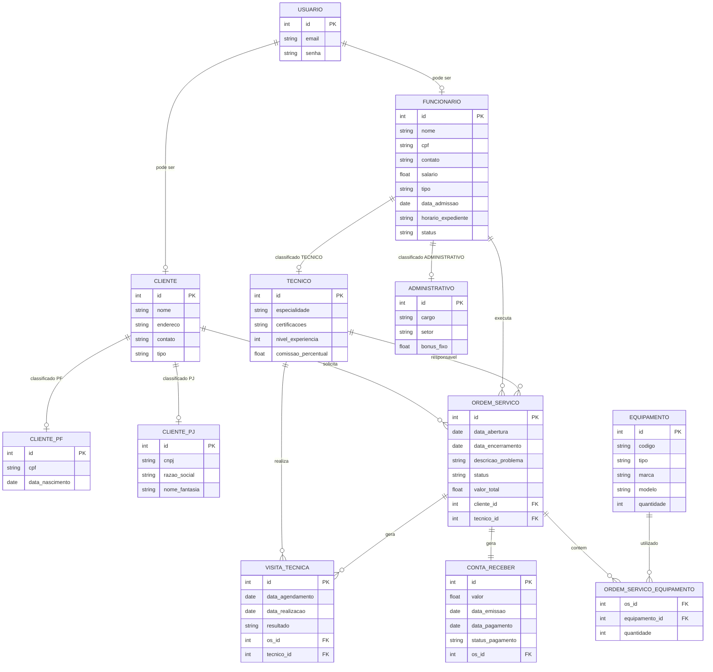

# Modelo de Dados

## 📊 Diagrama Entidade-Relacionamento (DER)

### Descrição das Entidades

Entidade                          |	Descrição   |
---------                         | ----------- |
Usuário	   | Entidade base para autenticação, contendo credenciais de acesso (email e senha). |
Cliente	   | Entidade base para clientes, contendo atributos comuns a qualquer cliente (nome, endereço, contato). Possui uma especialização total e disjunta para CPF e CNPJ. |
Cliente CPF	| Especialização da entidade Cliente. Armazena dados específicos de Pessoa Física: CPF e data de nascimento. |
Cliente CNPJ	| Especialização da entidade Cliente. Armazena dados específicos de Pessoa Jurídica: CNPJ, razão social e nome fantasia. |
Funcionário	 | Herda de Usuário. Armazena dados profissionais, diferenciando Técnico e Administrativo (especialização total e disjunta). |
Técnico | Especialização da entidade Funcionario. Armazena dados específicos como especialidade, certificações, nível de experiência e comissão percentual. Responsável pela execução de Ordens de Serviço e Visitas Técnicas.|
Administrativo | Especialização da entidade Funcionario. Armazena dados específicos como cargo, setor, bônus fixo e horário de expediente. Responsável por atividades administrativas e gestão. |
Ordem de Serviço | Núcleo do sistema, registra cada solicitação de serviço, seu status, valor, e vincula cliente e técnico responsável. |
Equipamento	| Representa os itens que serão reparados ou utilizados nos serviços. Contém informações como código, tipo, marca, modelo e quantidade disponível. |
Ordem de Serviço Equipamento | Tabela de relacionamento muitos-para-muitos entre OS e Equipamento. Armazena a quantidade de cada equipamento utilizado em uma determinada OS. |
Visita Técnica | Vinculada a uma OS, registra agendamentos e realizações de atendimentos presenciais. |
Conta a Receber	| Gerada automaticamente ao encerrar uma OS, registra o valor a ser pago pelo cliente. |

---

## Entidade-Relacionamento

### Dicionário de Dados

|   Tabela   | USUARIO |
| ---------- | ----------- |
| Descrição  | Armazena as credenciais de autenticação dos usuários do sistema. |
| Observação | É uma entidade abstrata/base para autenticação. Um usuário pode ser cliente ou funcionário, mas não ambos simultaneamente. |

|  Nome         | Descrição                        | Tipo de Dado | Tamanho | Restrições de Domínio |
| ------------- | -------------------------------- | ------------ | ------- | --------------------- |
| id | Identificador único gerado pelo SGBD	| SERIAL | --- | PK / Identity |
| e-mail | e-mail do usuário utilizado para login  | VARCHAR | 150 | Unique / Not Null |
| senha  | Senha criptografada do usuário | VARCHAR | 255 | Not Null |

|   Tabela   | CLIENTE |
| ---------- | ----------- |
| Descrição  | Armazena as informações gerais dos clientes da assistência técnica. |
| Observação | Clientes podem ser Pessoa Física (PF) ou Pessoa Jurídica (PJ). A diferenciação é feita pelo campo classificado, com dados complementares armazenados nas tabelas Cliente_PF e Cliente_PJ. |

|  Nome         | Descrição                        | Tipo de Dado | Tamanho | Restrições de Domínio |
| ------------- | -------------------------------- | ------------ | ------- | --------------------- |
| id | Identificador único | SERIAL | --- | PK / Identity |
| nome | Nome completo do cliente (PF) ou razão social (PJ) | VARCHAR | 150 | Not Null |
| endereco  | Endereço completo do cliente | VARCHAR | 200 | --- |
| contato | Telefone para contato | VARCHAR | 20 | --- |
| tipo | Classificação do cliente (PF ou PJ) | VARCHAR | 2 | com CHECK (tipo IN ('PF','PJ')) |

|   Tabela   | CLIENTE_PF |
| ---------- | ----------- |
| Descrição  | Armazena informações específicas de clientes do tipo Pessoa Física. |
| Observação | Todo cliente PF deve ter um registro correspondente na tabela Cliente.|

|  Nome         | Descrição                        | Tipo de Dado | Tamanho | Restrições de Domínio |
| ------------- | -------------------------------- | ------------ | ------- | --------------------- |
| id | Identificador único(FK para CLIENTE) | INT | --- | PK / FK |
| cpf | Cadastro de Pessoa Física | VARCHAR | 14 | Unique / Not Null |
| data_nascimento  | Data de nascimento do cliente | DATE | --- | Not Null |

|   Tabela   | CLIENTE_PJ |
| ---------- | ----------- |
| Descrição  | Armazena informações específicas de clientes do tipo Pessoa Jurítica. |
| Observação | Todo cliente PJ deve ter um registro correspondente na tabela Cliente.|

|  Nome         | Descrição                        | Tipo de Dado | Tamanho | Restrições de Domínio |
| ------------- | -------------------------------- | ------------ | ------- | --------------------- |
| id | Identificador único(FK para CLIENTE) | INT | --- | PK / FK |
| cnpj | Cadastro Nacional da Pessoa Jurídica | VARCHAR | 18 | Unique / Not Null |
| razao_social  | Razão social da empresa | VARCHAR | 150 | Not Null |
| nome_fantasia | Nome fantasia da empresa | VARCHAR | 100 | --- |

|   Tabela   | FUNCIONARIO |
| ---------- | ----------- |
| Descrição  | Armazena as informações gerais dos funcionários da assistência técnica. |
| Observação | Funcionários podem ser técnico ou administrativo. A diferenciação é feita pelo campo classificado, com dados complementares armazenados nas tabelas Técnico e Administrativo. |

|  Nome         | Descrição                        | Tipo de Dado | Tamanho | Restrições de Domínio |
| ------------- | -------------------------------- | ------------ | ------- | --------------------- |
| id | Identificador único | SERIAL | --- | PK / Identity |
| nome | Nome completo do Funcionário  | VARCHAR | 150 | Not Null |
| cpf |	Cadastro de Pessoa Física |	VARCHAR | 14 | Unique / Not Null |
| contato | Telefone para contato | VARCHAR | 20 | --- |
| salario |	Salário base do funcionário | DECIMAL(10,2) | --- |	Not Null |
| tipo | Classificação do cliente (PF ou PJ) | VARCHAR | 2 | PF, PJ / Not Null |
| data_admissao	| Data de contratação |	DATE | --- | Not Null |
| horario_expediente | Horário de trabalho | VARCHAR | 50 |	--- |
| status |	Situação do funcionário	| VARCHAR |	10	| CHECK (status IN ('ATIVO','FERIAS','AFASTADO','DESATIVADO'))

|   Tabela   | TECNICO |
| ---------- | ----------- |
| Descrição  | Responsável pela execução de Ordens de Serviço e Visitas Técnicas. Armazena dados específicos como especialidade, certificações, nível de experiência e comissão percentual. |
| Observação | Especialização da tabela FUNCIONARIO. Todo técnico deve ter um registro correspondente na tabela FUNCIONARIO com tipo = 'TECNICO'. |

|  Nome         | Descrição                        | Tipo de Dado | Tamanho | Restrições de Domínio |
| ------------- | -------------------------------- | ------------ | ------- | --------------------- |
| id | Identificador único(FK para FUNCIONARIO) | INT | --- | PK / FK |
| especialidade | Área de atuação principal | VARCHAR | 100 | Not Null |
| certificacoes  | Certificações técnicas (formato JSON ou texto) | TEXT| --- | --- |
| nivel_experiencia | Nível hierárquico (1-5) | INT | --- | CHECK (nivel_experiencia BETWEEN 1 AND 5) |
|comissao_percentual | Percentual de comissão sobre serviços | DECIMAL(5,2) | --- |	DEFAULT 0.00, CHECK (comissao_percentual >= 0) |

|   Tabela   | ADMINISTRATIVO |
| ---------- | ----------- |
| Descrição  | Responsável pela execução de Ordens de Serviço e Visitas Técnicas. Armazena dados específicos como especialidade, certificações, nível de experiência e comissão percentual. |
| Observação | Especialização da tabela FUNCIONARIO. Todo técnico deve ter um registro correspondente na tabela FUNCIONARIO com tipo = 'ADMINISTRATIVO'. |

|  Nome         | Descrição                        | Tipo de Dado | Tamanho | Restrições de Domínio |
| ------------- | -------------------------------- | ------------ | ------- | --------------------- |
| id | Identificador único(FK para FUNCIONARIO) | INT | --- | PK / FK |
| cargo | Cargo administrativo | VARCHAR | 80 | Not Null |
| certificacoes  | Certificações técnicas (formato JSON ou texto) | TEXT| --- | --- |
| setor | Nível hierárquico (1-5) | INT | --- | CHECK (nivel_experiencia BETWEEN 1 AND 5) |
|bonus_fixo | Bônus mensal fixo | DECIMAL(10,2) | --- |	DEFAULT 0.00 |