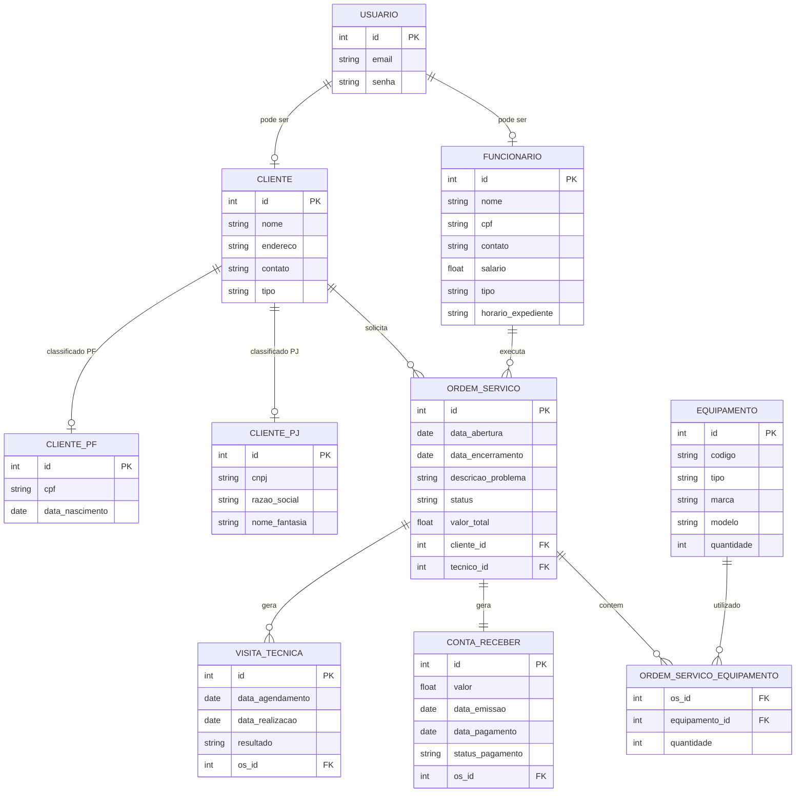

# Modelo de Dados

## 📊 Diagrama Entidade-Relacionamento (DER)

### Descrição das Entidades

Entidade                          |	Descrição   |
---------                         | ----------- |
Usuário	   | Entidade base para autenticação, contendo credenciais de acesso (email e senha). |
Cliente	   | Entidade base para clientes, contendo atributos comuns a qualquer cliente (nome, endereço, contato). Possui uma especialização total e disjunta para CPF e CNPJ. |
Cliente CPF	| Especialização da entidade Cliente. Armazena dados específicos de Pessoa Física: CPF e data de nascimento. |
Cliente CNPJ	| Especialização da entidade Cliente. Armazena dados específicos de Pessoa Jurídica: CNPJ, razão social e nome fantasia. |
Funcionário	 | Herda de Usuário. Armazena dados profissionais, diferenciando Técnico e Administrativo (especialização total e disjunta). |
Ordem de Serviço | Núcleo do sistema, registra cada solicitação de serviço, seu status, valor, e vincula cliente e técnico responsável. |
Equipamento	| Representa os itens que serão reparados ou utilizados nos serviços. |
Ordem de Serviço Equipamento | Tabela de relacionamento muitos-para-muitos entre OS e Equipamento. |
Visita Técnica | Vinculada a uma OS, registra agendamentos e realizações de atendimentos presenciais. |
Conta a Receber	| Gerada automaticamente ao encerrar uma OS, registra o valor a ser pago pelo cliente. |

---

## Entidade-Relacionamento

### Dicionário de Dados

|   Tabela   | USUARIO |
| ---------- | ----------- |
| Descrição  | Armazena as credenciais de autenticação dos usuários do sistema. |
| Observação | Um usuário pode ser cliente ou funcionário, mas não ambos simultaneamente. |

|  Nome         | Descrição                        | Tipo de Dado | Tamanho | Restrições de Domínio |
| ------------- | -------------------------------- | ------------ | ------- | --------------------- |
| id | Identificador único gerado pelo SGBD	| SERIAL | --- | PK / Identity |
| e-mail | e-mail do usuário utilizado para login  | VARCHAR | 150 | Unique / Not Null |
| senha  | Senha criptografada do usuário | VARCHAR | 255 | Not Null |

|   Tabela   | CLIENTE |
| ---------- | ----------- |
| Descrição  | Armazena as informações gerais dos clientes da assistência técnica. |
| Observação | Clientes podem ser Pessoa Física (PF) ou Pessoa Jurídica (PJ). A diferenciação é feita pelo campo tipo, com dados complementares armazenados nas tabelas Cliente_PF e Cliente_PJ. |

|  Nome         | Descrição                        | Tipo de Dado | Tamanho | Restrições de Domínio |
| ------------- | -------------------------------- | ------------ | ------- | --------------------- |
| id | Identificador único | SERIAL | --- | PK / Identity |
| nome | Nome completo do cliente (PF) ou razão social (PJ) | VARCHAR | 150 | Not Null |
| endereco  | Endereço completo do cliente | VARCHAR | 200 | --- |
| contato | Telefone para contato | ENUM | 12 | --- |
| tipo | Classificação do cliente (PF ou PJ) | VARCHAR | --- | PF, PJ / Not Null |

|   Tabela   | CLIENTE_PF |
| ---------- | ----------- |
| Descrição  | Armazena informações específicas de clientes do tipo Pessoa Física. |
| Observação | Todo cliente PF deve ter um registro correspondente na tabela Cliente.|

|  Nome         | Descrição                        | Tipo de Dado | Tamanho | Restrições de Domínio |
| ------------- | -------------------------------- | ------------ | ------- | --------------------- |
| id | Identificador único | SERIAL | --- | PK / Identity |
| nome | Nome completo do cliente (PF) ou razão social (PJ) | VARCHAR | 150 | Not Null |
| endereco  | Endereço completo do cliente | VARCHAR | 200 | --- |
| contato | Telefone para contato | ENUM | 12 | --- |
| tipo | Classificação do cliente (PF ou PJ) | VARCHAR | --- | PF, PJ / Not Null |
