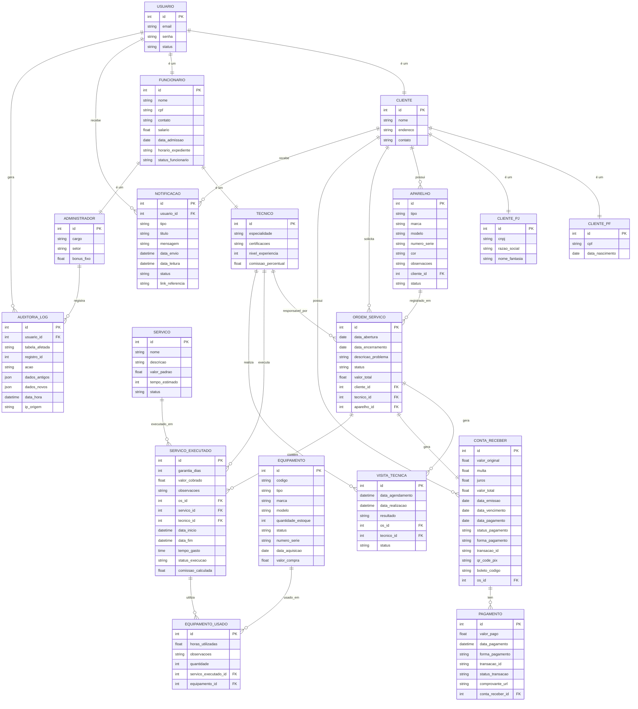

# Documento de Visão

## Descrição do Projeto

Título: Sistema de Gestão de Assistência Técnica

Descrição: O Sistema de Gestão de Assistência Técnica é uma aplicação web que tem como objetivo gerenciar clientes, ordens de serviço, equipamentos e visitas técnicas de forma organizada e eficiente. Ele permite cadastrar e acompanhar ordens de serviço e gerar relatórios para facilitar o acompanhamento das atividades. O sistema oferece diferentes perfis de usuários, permitindo que cada um acesse funcionalidades específicas de acordo com suas permissões.

---

## Equipe e Definição de Papéis

Membro     |     Papel   |   E-mail   |
---------  | ----------- | ---------- |
Jadson     | Desenvolvedor, Testador | jadsonhipolito@gmail.com |
Mariana    | Analista, Desenvolvedor | araujodemedeirosmariana@gmail.com |

---

### Matriz de Competências

Membro     |     Competências   |
---------  | ----------- |
Jadson    | Python, FastAPI, SQLite, Git/GitHub, Modelagem de Dados, Arquitetura de Software |
Mariana   | Python, SQLite, Git/GitHub | 

---

## Perfis dos Usuários

O sistema poderá ser utilizado por diversos usuários. Temos os seguintes perfis/atores:

Perfil                                 | Descrição   |
---------                              | ----------- |
Cliente | Este usuário pode verificar suas ordens de serviço, consultar contas a receber e realizar pagamentos online de serviços concluídos.
Administrativo | Este usuário é responsável pela gestão do sistema, cadastro de informações, controle financeiro e registro de pagamentos recebidos fora do sistema.
Técnico | Este usuário é responsável pela execução dos serviços, atualização das ordens de serviço e registro de peças utilizadas.

---

## Lista de Requisitos Funcionais

### Entidade Realizar Login no Sistema - RF00 - Manter Usuario
Permite que usuários (clientes e funcionários) realizem autenticação no sistema com e-mail e senha, conforme tabela USUARIO.

Requisito                     | Descrição   | Ator                      |
---------                     | ----------- | ----------                |
RF00.1 - Realizar Login       | Autenticar usuário com e-mail e senha, gerando sessão ou token de acesso | Cliente, Administrador, Técnico |
RF00.2 - Recuperar Senha      | Permitir que o usuário recupere sua senha via e-mail | Cliente, Administrador, Técnico |
RF00.3 - Logout               | Encerrar a sessão do usuário no sistema | Cliente, Administrador, Técnico |

---

### Entidade Cliente - RF01 - Manter Cliente
Um cliente representa uma pessoa ou empresa que utiliza os serviços da assistência técnica. Possui informações detalhadas como nome, endereço, contato, CPF e histórico de serviços.

Regra: Um cliente deve ser obrigatoriamente CPF ou CNPJ, não podendo ser ambos.

Requisito                     | Descrição   | Ator |
---------                     | ----------- | ---------- |
RF01.1 - Cadastrar Cliente   | Insere novo novo cliente informando: id, nome, endereço, contato, CPF. | Administrador |
RF01.2 - Alterar Cliente     | Atualiza qualquer dado contido no cadastro do cliente, caso seja necessário. | Administrador |
RF01.3 - Consultar Cliente   | Consulta do cliente através dos dados do mesmo. | Administrador, Técnico |
RF01.4 - Desativar Cliente   | Desativar um cliente informando o id. | Administrador |

---

### Entidade Funcionário - RF02 - Manter Funcionário
Um funcionário representa o usuário responsável pelas operações do sistema, classificados como: Técnico e Administrador.

Requisito                     | Descrição   | Ator           |
---------                     | ----------- | ----------     |
RF02.1 - Cadastrar Funcionário | Insere novo funcionário informando: código, nome, CPF, cargo, salario, carteira, expendiente. | Administrador |
RF02.2 - Alterar Funcionário | Atualiza um funcionário informando: código, nome, CPF, cargo, salario, carteira, expendiente. | Administrador |
RF02.3 - Consultar Funcionário |  Consulta do funcionário através dos dados do mesmo. | Administrador |
RF02.4 - Desativar Funcionário | Desativar um funcionário informando o id. | Administrador |

---

### Entidade Aparelho - RF03 - Gerenciar Aparelho
Um aparelho representa um equipamento pertencente ao cliente que será avaliado, reparado ou acompanhado pela assistência técnica.

Requisito | Descrição | Ator
--------- | ----------- | ----------
RF03.1 - Cadastrar Aparelho | Permite cadastrar aparelho vinculado a um cliente | Administrador
RF03.2 - Alterar Aparelho | Atualiza dados do aparelho | Administrador
RF03.3 - Consultar Aparelho | Consulta aparelho por id, tipo, marca, modelo ou número de série | Administrador, Técnico
RF03.4 - Desativar Aparelho | Desativa aparelho sem OS em andamento | Administrador

---

### Entidade Ordem_Serviço - RF04 - Gerenciar Ordem_Serviço
Uma ordem de serviço registra o atendimento realizado, podendo conter vários equipamentos e status de acompanhamento.

Requisito                     | Descrição   | Ator           |
---------                     | ----------- | ----------     |
RF04.1 - Abrir ordem de Serviço  | Criar de order de serviço para solicitação de reparo ou manutenção, incluir informações sobre o cliente, descrição do problema e quaisquer detalhes relevantes. | Administrador |
RF04.2 - Editar ordem de serviço | Atualiza uma OS informando:informações sobre o cliente, descrição do problema e quaisquer detalhes relevantes. | Administrador |
RF04.3 - Consultar ordem de serviço | Consulta uma OS informando: id. | Técnico, Administrador, Cliente |
RF04.4 - Atualizar Status da OS     | Alterar o status da OS conforme andamento. | Técnico, Administrador |
RF04.5 - Encerrar ordem de serviço   | Encerramento da OS após a conclusão das atividades.  | Técnico |
RF04.6 - Emitir Relatório     | Gerar relatórios diversos, como histórico de serviços realizados, faturamento por período, entre outros.  | Técnico, Administrador |

---

### Entidade Serviço - RF05 - Manter Serviço
Representa o catálogo de serviços oferecidos pela assistência técnica.

Requisito | Descrição | Ator
--------- | ----------- | ----------
RF05.1 - Cadastrar Serviço | Cadastra serviço no catálogo | Administrador
RF05.2 - Alterar Serviço | Atualiza serviço existente | Administrador
RF05.3 - Consultar Serviço | Consulta serviços cadastrados | Administrador, Técnico
RF05.4 - Desativar Serviço | Desativa serviço do catálogo | Administrador

---

### Entidade Serviço_Usado - RF06 - Registrar Serviço_Executado
Registra a execução de um serviço específico em uma ordem de serviço, com controle de tempo real, técnico responsável e cálculo automático de comissão.

| Requisito | Descrição | Ator |
|-----------|-----------|------|
| RF06.1 - Registrar Serviço na OS | Associa um serviço do catálogo a uma ordem de serviço, definindo valor_cobrado (pode ser diferente do valor_padrao) e garantia_dias | Administrador, Técnico |
| RF06.2 - Iniciar Execução | Técnico inicia a execução de um serviço, registrando data_inicio e status_execucao = 'EM_EXECUCAO' | Técnico |
| RF06.3 - Pausar Execução | Técnico pausa a execução, registrando tempo_pausa acumulado e status_execucao = 'PAUSADO' | Técnico |
| RF06.4 - Retomar Execução | Técnico retoma a execução pausada, voltando status_execucao para 'EM_EXECUCAO' | Técnico |
| RF06.5 - Finalizar Execução | Técnico finaliza a execução, registrando data_fim, calculando tempo_gasto e status_execucao = 'CONCLUIDO' | Técnico |
| RF06.6 - Múltiplos Técnicos | Permite que diferentes técnicos executem serviços distintos na mesma OS | Técnico |
| RF06.7 - Calcular Comissão | Calcula automaticamente comissão do técnico baseada no valor_cobrado e comissao_percentual do técnico | Sistema |
| RF06.8 - Calcular Garantia | Sistema calcula data de fim da garantia com base na data_fim + garantia_dias | Sistema |
| RF06.9 - Verificar Garantia Ativa | Permite verificar se um serviço executado ainda está dentro do período de garantia | Administrador, Técnico |
| RF06.10 - Consultar Serviços Executados | Permite consultar serviços executados por OS, por técnico, por período ou por status | Administrador, Técnico |
| RF06.11 - Relatório Produtividade | Gera relatório de produtividade por técnico/período (total serviços, tempo gasto, comissão) | Administrador |

---

### Entidade Equipamento  - RF07 - Gerenciar Equipamento 
Um componente essencial ao realizar OS. Ele tem: código, tipo, marca, modelo, quantidade.

Requisito                     | Descrição   | Ator           |
---------                     | ----------- | ----------     |
RF07.1 - Cadastrar Equipamento   | Insere novo equipamento informando: código, tipo, marca, modelo, quantidade. | Administrador |
RF07.2 - Listar Equipamento   | Listagem dos equipamentos cadastrados. | Administrador, Técnico |
RF07.3 - Consultar Equipamento | Consultar equipamento informando: código, tipo, marca, modelo. | Administrador, Técnico |
RF07.4 - Desativar Equipamento   | Desativa um equipamento informando seu identificador. | Administrador |

---

### Entidade Equipamento Usado - RF08 - Gerenciar Equipamento_Usado
Controla os equipamentos/peças utilizados em um serviço executado.

Requisito | Descrição | Ator
--------- | ----------- | ----------
RF08.1 - Registrar Equipamento Utilizado | Vincula equipamento a serviço executado | Técnico
RF08.2 - Consultar Equipamentos Utilizados | Consulta equipamentos utilizados em uma OS | Técnico, Administrador
RF08.3 - Atualizar Quantidade Utilizada | Atualiza quantidade utilizada | Técnico
RF08.4 - Remover Equipamento Utilizado | Remove equipamento associado | Técnico

---

### Entidade Visita_Técnica - RF09 - Agendar Visita_Técnica
Uma visita técnica representa um atendimento presencial vinculado a uma ordem de serviço.

Requisito                     | Descrição   | Ator           |
---------                     | ----------- | ----------     |
RF09.1 - Agendar Visitas Técnicas  | Funcionalidade que permite ao funcionário administrativo agendar visitas presenciais para resolver problemas que não podem ser resolvidos remotamente.  | Administrador |
RF09.2 - Registrar Realização da Visita | Funcionalidade que permite ao técnico registrar a data e o resultado da visita.|	Técnico |

---

### Entidade Conta_Receber - RF10 - Gerenciar Contas_Receber 
Ao salvar uma OS é criado um conta receber automaticamente, na qual possuir: id,valor, data de pagamento, também permitir a funcionalidade ao cliente selecionar uma conta a pagar e com os detalhes do pagamento, incluindo o valor a ser pago, de forma conveniente e segura.

Requisito                     | Descrição   | Ator           |
---------                     | ----------- | ----------     |
| RF10.1 - Registrar Conta Receber | Ao salvar uma OS é criado um conta receber automaticamente | Sistema |
| RF10.2 - Registrar Pagamento Offline | Administrador registra pagamentos fora do sistema | Administrador |
| RF10.3 - Visualizar Contas Pendentes | Cliente visualiza contas PENDENTE ou VENCIDO | Cliente |
| RF10.4 - Selecionar Conta para Pagamento | Cliente seleciona uma ou múltiplas contas | Cliente |
| RF10.5 - Realizar Pagamento Online | Integrar com gateway de pagamento | Cliente, Sistema |
| RF10.6 - Confirmar Pagamento | Atualizar status para PAGO | Sistema |
| RF10.7 - Emitir Comprovante | Gerar comprovante PDF | Sistema |
| RF10.8 - Calcular Multa | Aplicar multa 2% + juros 0.33%/dia | Sistema |

---

### Entidade Pagamento - RF11 - Gerenciar Pagamento
Registra cada transação de pagamento realizada, permitindo que uma única conta a receber tenha múltiplos pagamentos (parcelado).

| Requisito | Descrição | Ator |
|-----------|-----------|------|
| RF11.1 - Processar Pagamento | Processa pagamento via gateway integrado | Sistema |
| RF11.2 - Confirmar Pagamento | Confirma transação e atualiza status | Sistema |
| RF11.3 - Estornar Pagamento | Administrador pode estornar pagamento | Administrador |
| RF11.4 - Emitir Comprovante | Gera comprovante PDF do pagamento | Sistema |
| RF11.5 - Validar Transação | Valida transação com gateway | Sistema |
| RF11.6 - Pagamento Parcelado | Permite múltiplos pagamentos para uma conta | Cliente |

---

### Entidade Relatórios - RF12 - Gerar Relatório
Permite gerar um relatório de ordens de serviço filtrado por período de abertura, status e técnico responsável, com opção de exportação (PDF/CSV).

| Requisito | Descrição                         | Ator          |
| --------- | --------------------------------- | ------------- |
| RF12.1    | Gerar relatório de OS por período | Administrador |
| RF12.2    | Filtrar por status                | Administrador |
| RF12.3    | Filtrar por técnico               | Administrador |
| RF12.4    | Exportar PDF/CSV                  | Administrador |

---

### Entidade Controle de Garantia - RF13 - Controle de Garantia
Permite consultar e controlar o período de garantia das ordens de serviço finalizadas, com alerta para garantias próximas do vencimento ou já expiradas.

| Requisito | Descrição                         | Ator          |
| --------- | --------------------------------- | ------------- |
| RF13.1 | Consultar garantias ativas	| Técnico, Administrador |
| RF13.2 |	Alertar garantias próximas do vencimento |	Sistema |
| RF13.3 |	Registrar atendimento em garantia |	Técnico |

---

### Modelo Conceitual

Abaixo apresentamos o modelo conceitual usando o **Mermaid**.

#### Descrição das Entidades

Entidade                          |	Descrição   |
---------                         | ----------- |
Usuário	   | Entidade base abstrata para representar informações gerais de acesso ao sistema: id, email, senha, status. Possui o método +autenticar(email, senha), +recuperarSenha(email), +logout(),+alterarSenha(novaSenha),   +alterarEmail(novoEmail) para validação de credenciais. |
Cliente	   | Entidade que representa um cliente do sistema, estendendo USUARIO. Contém informações cadastrais: nome, endereco, contato. Possui o método +solicitarOrdemServico(), +visualizarMinhasContas(), +visualizarMeusAparelhos(), +visualizarMinhasOS(),+selecionarContasParaPagamento(contasIds), +realizarPagamentoOnline(contasIds, formaPagamento, +obterComprovantePagamento(contaId). |
Cliente CPF	| Especialização de CLIENTE para pessoa física. Adiciona os atributos cpf e data_nascimento. |
Cliente CNPJ	| Especialização de CLIENTE para pessoa jurídica. Adiciona os atributos cnpj, razao_social e nome_fantasia. |
Funcionário	 | Especialização de funcionário para técnico. Contém dados como nome, cpf, contato, salario, data_admissao, horario_expediente e status. Possui o método +registrarPonto() para controle de jornada. |
Técnico | Especialização de FUNCIONARIO para técnicos especializados. Adiciona especialidade, certificacoes, nivel_experiencia e comissao_percentual. Possui os métodos +iniciarExecucaoServico(servicoExecutadoId), +pausarExecucaoServico(servicoExecutadoId), +retomarExecucaoServico(servicoExecutadoId), +finalizarExecucaoServico(servicoExecutadoId), +registrarVisita(visitaId, resultado), +atualizarStatusOS(osId, novoStatus) e +calcularComissao() para gestão de serviços e remuneração variável.|
Administrador | Especialização de FUNCIONARIO para administradores do sistema. Adiciona cargo, setor e bonus_fixo. Possui o método +gerenciarFuncionarios(), +gerenciarClientes(), +gerenciarAparelhos(), +gerenciarServicos(), +gerenciarEquipamentos(), +registrarPagamentoOffline(contaId, formaPagamento), +cancelarConta(contaId), +gerarRelatorioOS(filtros),+agendarVisitaTecnica(osId, dataAgendamento)|
Aparelho | Entidade que representa os aparelhos dos clientes que serão reparados. Contém informações técnicas: tipo, marca, modelo, numero_serie, cor, observacoes e cliente_id e status. Possui os métodos +getHistoricoOS() para consultar todas as ordens de serviço do aparelho e +atualizarObservacoes() para manutenção do registro. |
Ordem_Serviço | Entidade central que representa uma ordem de serviço aberta para reparo. Contém id, data_abertura, data_encerramento, descricao_problema, status, valor_total, cliente_id, tecnico_id e aparelho_id. Possui métodos para +calcularValorTotal(), +alterarStatus(novoStatus), +adicionarServico(servicoId, quantidade), +removerServico(servicoExecutadoId), +adicionarEquipamentoUsado(equipamentoId, quantidade) e +imprimirRelatorio(). |
Serviço | Entidade que representa um tipo de serviço oferecido pela assistência (ex: limpeza, troca de tela, reparo de placa). Contém nome, descricao, valor_padrao, tempo_estimado e status. Possui métodos para +aplicarDesconto(percentual) e +calcularTempoTotal(). |
Serviço_executado | Entidade associativa que registra a execução de um serviço específico em uma ordem de serviço. Contém garantia_dias,valor_cobrado (que pode ser diferente do valor padrão), observacoes, os_id, servico_id, tecnico_id, data_inicio, data_fim, tempo_gasto, status_execucao, comissao_calculada. Possui o método +calcularGarantia(), +calcularTempoGasto(),+calcularComissao() e +verificarGarantiaAtiva() para formalizar a realização do serviço. |
Equipamento	| Entidade que representa insumos, ferramentas ou peças do estoque da assistência. Contém codigo, tipo, marca, modelo, quantidade_estoque, status, numero_serie, data_aquisicao e valor_compra. Possui métodos para +diminuirEstoque(), +verificarDisponibilidade() e +reporEstoque() para controle de inventário. |
Equipamento_usado | Entidade associativa que registra quais equipamentos/peças foram consumidos ou utilizados em cada serviço executado. Contém horas_utilizadas, observacoes, servico_executado_id, equipamento_id e quantidade. Possui o método +calcularCustoUso() para apurar o custo dos insumos aplicados. |
Visita_Técnica | Entidade que representa visitas realizadas por técnicos na residência do cliente. Contém data_agendamento, data_realizacao, resultado, os_id e tecnico_id e status. Possui métodos para +registrarVisita(), +reagendar() e +cancelar() para gestão do atendimento externo. |
Conta_Receber	| Entidade que representa as obrigações financeiras geradas pelas ordens de serviço. Contém valor_original, multa, juros, valor_total, data_emissao, data_vencimento, data_pagamento, status_pagamento, forma_pagamento, transacao_id, -string qr_code_pix, string boleto_codigo e os_id. Possui métodos para +calcularTotalComJuros(), +marcarComoPago(), +gerarQRCodePix(), +gerarBoleto(), +aplicarMulta() e +validarPagamento() para gestão financeira completa. |
Pagamento | Representa o ato do pagamento em si (transação, comprovante, processamento). Uma CONTA_RECEBER pode gerar um PAGAMENTO. Contém valor_pago, data_pagamento, forma_pagamento, transacao_id, status_transacao, comprovante_url. Possui métodos para       +processarPagamento(), +confirmarPagamento(), +estornarPagamento(), +emitirComprovante().|
| Notificaçao | Entidade que representa as notificações enviadas pelo sistema aos usuários sobre eventos importantes. Contém usuario_id (destinatário), tipo (GARANTIA_EXPIRANDO, CONTA_VENCENDO, OS_ATUALIZADA, VISITA_AGENDADA, PAGAMENTO_CONFIRMADO), titulo, mensagem, data_envio, data_leitura, status (ENVIADO, LIDO, FALHOU) e link_referencia. Possui métodos para +enviar() (dispara a notificação) e +marcarComoLida() (registra leitura pelo usuário).|
| Auditoria_log | Entidade que registra todas as ações dos usuários no sistema para fins de rastreabilidade, conformidade e segurança. Contém usuario_id (quem executou a ação), tabela_afetada (nome da tabela modificada), registro_id (ID do registro afetado), acao (INSERT, UPDATE, DELETE, STATUS_CHANGE), dados_antigos (JSON com estado anterior), dados_novos (JSON com novo estado), data_hora (timestamp da ação) e ip_origem (endereço IP da requisição). Possui métodos para +registrar() (insere o log automaticamente) e +consultarLogs(filtros) (permite consulta filtrada). Os logs são imutáveis e não podem ser alterados ou excluídos.|

---

## Lista de Requisitos Não-Funcionais

Requisito                                 | Descrição   |
---------                                 | ----------- |
RNF01 - Deve ser acessível via navegador | Deve abrir perfeitamento no Firefox e no Chrome. |
RNF02 - Usabilidade | O sistema deverá possuir uma interface intuitiva e de fácil utilização, permitindo que usuários com pouca experiência em sistemas consigam utilizá-lo sem dificuldades significativas. |
RNF03 -	Segurança |	As senhas dos usuários devem ser armazenadas de forma criptografada (hash). O controle de acesso deve ser rigorosamente baseado nos perfis definidos. |
RNF04 - Desempenho | O sistema deve responder às operações principais em até 3 segundos em condições normais de uso.|
RNF05 - Backup | O banco de dados deve permitir realização de backups periódicos para recuperação de informações.|

---

## Riscos

Data | Risco | Prioridade | Responsável | Status | Providência/Solução |
------ | ------ | ------ | ------ | ------ | ------ |
31/03/2026 | Mudança de escopo com inclusão de funcionalidades não planejadas durante o desenvolvimento. | Alta | Mariana | Monitorando	| Utilizar metodologia ágil com sprints curtas para priorizar entregas e congelar escopo a cada iteração. |
31/03/2026 | Indisponibilidade ou falha na integração com gateway de pagamento. | Média | Jadson | Monitorando | Pesquisar e ter um plano B com outro provedor de pagamento; implementar registro de falhas para retentativa. |
31/03/2026 | Dificuldade de adaptação dos usuários à nova ferramenta. |	Média |	Mariana | Monitorando |	Realizar treinamentos iniciais e produzir manuais de usuário simplificados. |

### Referências

MODELO BSI – Doc 001 – Documento de Visão. Documento construído a partir do modelo BSI. Disponível em: https://docs.google.com/document/d/1DPBcyGHgflmz5RDsZQ2X8KVBPoEF5PdAz9BBNFyLa6A/edit?usp=sharing
. Acesso em: 28 mar. 2026.

