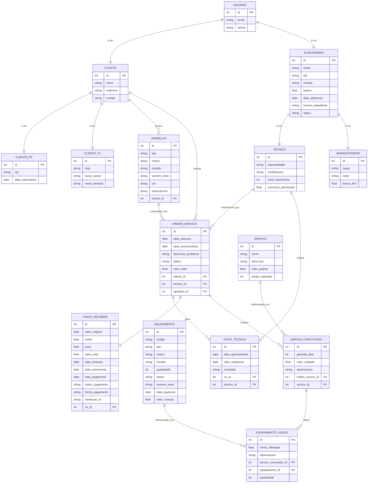

# Documento de Visão

## Descrição do Projeto

Título: Sistema de Gestão de Assistência Técnica

Descrição: O Sistema de Gestão de Assistência Técnica é uma aplicação web que tem como objetivo gerenciar clientes, ordens de serviço, equipamentos e visitas técnicas de forma organizada e eficiente. Ele permite cadastrar e acompanhar ordens de serviço e gerar relatórios para facilitar o acompanhamento das atividades. O sistema oferece diferentes perfis de usuários, permitindo que cada um acesse funcionalidades específicas de acordo com suas permissões.

---

## Equipe e Definição de Papéis

Membro     |     Papel   |   E-mail   |
---------  | ----------- | ---------- |
Jadson     | Desenvolvedor, Testador | jadsonhipolito@gmail.com |
Mariana    | Analista, Desenvolvedor | araujodemedeirosmariana@gmail.com |

---

### Matriz de Competências

Membro     |     Competências   |
---------  | ----------- |
Jadson    | Python, FastAPI, SQLite, Git/GitHub, Modelagem de Dados, Arquitetura de Software |
Mariana   | Python, SQLite, Git/GitHub | 

---

## Perfis dos Usuários

O sistema poderá ser utilizado por diversos usuários. Temos os seguintes perfis/atores:

Perfil                                 | Descrição   |
---------                              | ----------- |
Cliente | Este usuário pode verificar suas ordens de serviço, consultar contas a receber e realizar pagamentos online de serviços concluídos.
Administrativo | Este usuário é responsável pela gestão do sistema, cadastro de informações, controle financeiro e registro de pagamentos recebidos fora do sistema.
Técnico | Este usuário é responsável pela execução dos serviços, atualização das ordens de serviço e registro de peças utilizadas.

---

## Lista de Requisitos Funcionais

### Entidade Realizar Login no Sistema - RF00 - Manter Usuario
Permite que usuários (clientes e funcionários) realizem autenticação no sistema com e-mail e senha, conforme tabela USUARIO.

Requisito                     | Descrição   | Ator                      |
---------                     | ----------- | ----------                |
RF00.1 - Realizar Login       | Autenticar usuário com e-mail e senha, gerando sessão ou token de acesso | Cliente, Administrador, Técnico |
RF00.2 - Recuperar Senha      | Permitir que o usuário recupere sua senha via e-mail | Cliente, Administrador, Técnico |
RF00.3 - Logout               | Encerrar a sessão do usuário no sistema | Cliente, Administrador, Técnico |

---

### Entidade Cliente - RF01 - Manter Cliente
Um cliente representa uma pessoa ou empresa que utiliza os serviços da assistência técnica. Possui informações detalhadas como nome, endereço, contato, CPF e histórico de serviços.

Regra: Um cliente deve ser obrigatoriamente CPF ou CNPJ, não podendo ser ambos.

Requisito                     | Descrição   | Ator |
---------                     | ----------- | ---------- |
RF01.1 - Cadastrar Cliente   | Insere novo novo cliente informando: id, nome, endereço, contato, CPF. | Administrador |
RF01.2 - Alterar Cliente     | Atualiza qualquer dado contido no cadastro do cliente, caso seja necessário. | Administrador |
RF01.3 - Consultar Cliente   | Consulta do cliente através dos dados do mesmo. | Administrador, Técnico |
RF01.4 - Desativar Cliente   | Desativar um cliente informando o id. | Administrador |

---

### Entidade Funcionário - RF02 - Manter Funcionário
Um funcionário representa o usuário responsável pelas operações do sistema, classificados como: Técnico e Administrador.

Requisito                     | Descrição   | Ator           |
---------                     | ----------- | ----------     |
RF02.1 - Cadastrar Funcionário | Insere novo funcionário informando: código, nome, CPF, cargo, salario, carteira, expendiente. | Administrador |
RF02.2 - Alterar Funcionário | Atualiza um funcionário informando: código, nome, CPF, cargo, salario, carteira, expendiente. | Administrador |
RF02.3 - Consultar Funcionário |  Consulta do funcionário através dos dados do mesmo. | Administrador |
RF02.4 - Desativar Funcionário | Desativar um funcionário informando o id. | Administrador |

---

### Entidade Aparelho - RF03 - Gerenciar Aparelho
Um aparelho representa um equipamento pertencente ao cliente que será avaliado, reparado ou acompanhado pela assistência técnica.

Requisito | Descrição | Ator
--------- | ----------- | ----------
RF03.1 - Cadastrar Aparelho | Permite cadastrar aparelho vinculado a um cliente | Administrador
RF03.2 - Alterar Aparelho | Atualiza dados do aparelho | Administrador
RF03.3 - Consultar Aparelho | Consulta aparelho por id, tipo, marca, modelo ou número de série | Administrador, Técnico
RF03.4 - Desativar Aparelho | Desativa aparelho sem OS em andamento | Administrador

---

### Entidade Ordem de Serviço - RF04 - Gerenciar Ordem de Serviço
Uma ordem de serviço registra o atendimento realizado, podendo conter vários equipamentos e status de acompanhamento.

Requisito                     | Descrição   | Ator           |
---------                     | ----------- | ----------     |
RF04.1 - Abrir ordem de Serviço  | Criar de order de serviço para solicitação de reparo ou manutenção, incluir informações sobre o cliente, descrição do problema e quaisquer detalhes relevantes. | Administrador |
RF04.2 - Editar ordem de serviço | Atualiza uma OS informando:informações sobre o cliente, descrição do problema e quaisquer detalhes relevantes. | Administrador |
RF04.3 - Consultar ordem de serviço | Consulta uma OS informando: id. | Técnico, Administrador, Cliente |
RF04.4 - Atualizar Status da OS     | Alterar o status da OS conforme andamento. | Técnico, Administrador |
RF04.5 - Encerrar ordem de serviço   | Encerramento da OS após a conclusão das atividades.  | Técnico |
RF04.6 - Emitir Relatório     | Gerar relatórios diversos, como histórico de serviços realizados, faturamento por período, entre outros.  | Técnico, Administrador |

---

### Entidade Serviço - RF05 - Manter Catálogo de Serviços
Representa o catálogo de serviços oferecidos pela assistência técnica.

Requisito | Descrição | Ator
--------- | ----------- | ----------
RF05.1 - Cadastrar Serviço | Cadastra serviço no catálogo | Administrador
RF05.2 - Alterar Serviço | Atualiza serviço existente | Administrador
RF05.3 - Consultar Serviço | Consulta serviços cadastrados | Administrador, Técnico
RF05.4 - Desativar Serviço | Desativa serviço do catálogo | Administrador

---

### Entidade Equipamento  - RF06 - Gerenciar Equipamento 
Um componente essencial ao realizar OS. Ele tem: código, tipo, marca, modelo, quantidade.

Requisito                     | Descrição   | Ator           |
---------                     | ----------- | ----------     |
RF06.1 - Cadastrar Equipamento   | Insere novo equipamento informando: código, tipo, marca, modelo, quantidade. | Administrador |
RF06.2 - Listar Equipamento   | Listagem dos equipamentos cadastrados. | Administrador, Técnico |
RF06.3 - Consultar Equipamento | Consultar equipamento informando: código, tipo, marca, modelo. | Administrador, Técnico |
RF06.4 - Desativar Equipamento   | Desativa um equipamento informando seu identificador. | Administrador |

---

### Entidade Equipamento Usado - RF07 - Gerenciar Equipamento Usado
Controla os equipamentos/peças utilizados em um serviço executado.

Requisito | Descrição | Ator
--------- | ----------- | ----------
RF07.1 - Registrar Equipamento Utilizado | Vincula equipamento a serviço executado | Técnico
RF07.2 - Consultar Equipamentos Utilizados | Consulta equipamentos utilizados em uma OS | Técnico, Administrador
RF07.3 - Atualizar Quantidade Utilizada | Atualiza quantidade utilizada | Técnico
RF07.4 - Remover Equipamento Utilizado | Remove equipamento associado | Técnico

---

### Entidade Visita Técnica - RF08 - Agendar Visitas Técnicas
Uma visita técnica representa um atendimento presencial vinculado a uma ordem de serviço.

Requisito                     | Descrição   | Ator           |
---------                     | ----------- | ----------     |
RF08.1 - Agendar Visitas Técnicas  | Funcionalidade que permite ao funcionário administrativo agendar visitas presenciais para resolver problemas que não podem ser resolvidos remotamente.  | Administrador |
RF08.2 - Registrar Realização da Visita | Funcionalidade que permite ao técnico registrar a data e o resultado da visita.|	Técnico |

---

### Entidade Registrar Conta Receber e Pagamentos - RF09 - Gerenciar Contas a Receber e Pagamentos
Ao salvar uma OS é criado um conta receber automaticamente, na qual possuir: id,valor, data de pagamento, também permitir a funcionalidade ao cliente selecionar uma conta a pagar e com os detalhes do pagamento, incluindo o valor a ser pago, de forma conveniente e segura.

Requisito                     | Descrição   | Ator           |
---------                     | ----------- | ----------     |
RF09.1 - Registrar Conta Receber | Ao salvar uma OS é criado um conta receber automaticamente. | Sistema |
RF09.2 - Registrar Pagamento Offline | O sistema deve permitir que o funcionário administrativo registre pagamentos recebidos fora do sistema. | Administrador |
RF09.3 -  Visualizar Contas Pendentes     | Permitir que o cliente visualize todas as suas contas a receber com status PENDENTE ou VENCIDO | Cliente  |
RF09.4 - Selecionar Conta para Pagamento | Permitir que o cliente selecione uma ou múltiplas contas para realizar o pagamento | Cliente |
RF09.5 - Realizar Pagamento Online | Integrar com gateway de pagamento para processar o pagamento de forma segura | Cliente, Sistema |
RF09.6 - Confirmar Pagamento | Atualizar status da conta para PAGO e registrar data_pagamento após confirmação do gateway | Sistema |
RF09.7 - Emitir Comprovante | Gerar comprovante de pagamento (PDF) para o cliente após confirmação | Sistema |
RF09.8 - Calcular Multa | Aplicar multa automaticamente para contas vencidas (configurável: 2% + juros 0.33% ao dia) | Sistema |

---

### Entidade Relatórios - RF10 - Gerar Relatórios
Permite gerar um relatório de ordens de serviço filtrado por período de abertura, status e técnico responsável, com opção de exportação (PDF/CSV).

| Requisito | Descrição                         | Ator          |
| --------- | --------------------------------- | ------------- |
| RF10.1    | Gerar relatório de OS por período | Administrador |
| RF10.2    | Filtrar por status                | Administrador |
| RF10.3    | Filtrar por técnico               | Administrador |
| RF10.4    | Exportar PDF/CSV                  | Administrador |

---

### Entidade Controle de Garantia - RF11 - Controle de Garantia
Permite consultar e controlar o período de garantia das ordens de serviço finalizadas, com alerta para garantias próximas do vencimento ou já expiradas.

| Requisito | Descrição                         | Ator          |
| --------- | --------------------------------- | ------------- |
| RF11.1 | Consultar garantias ativas	| Técnico, Administrador |
| RF11.2 |	Alertar garantias próximas do vencimento |	Sistema |
| RF11.3 |	Registrar atendimento em garantia |	Técnico |

---

### Modelo Conceitual

Abaixo apresentamos o modelo conceitual usando o **Mermaid**.

#### Descrição das Entidades

Entidade                          |	Descrição   |
---------                         | ----------- |
Usuário	   | Entidade base para autenticação, contendo credenciais de acesso (email e senha). |
Cliente	   | Herda de Usuário. Entidade base para clientes, contendo atributos comuns a qualquer cliente (nome, endereço, contato). Possui uma especialização total e disjunta para CPF e CNPJ. |
Cliente PF	| Especialização da entidade Cliente. Armazena dados específicos de Pessoa Física: CPF e data de nascimento. |
Cliente PJ	| Especialização da entidade Cliente. Armazena dados específicos de Pessoa Jurídica: CNPJ, razão social e nome fantasia. |
Funcionário	 | Herda de Usuário. Entidade base para funcionario. Armazena dados profissionais, diferenciando Técnico e Administrador (especialização total e disjunta). |
Técnico | Especialização de FUNCIONARIO para técnicos especializados. Adiciona especialidade, certificacoes, nivel_experiencia e comissao_percentual.|
Administrador | Especialização de FUNCIONARIO para administradores do sistema. Adiciona cargo, setor e bonus_fixo. |
Aparelho | Entidade que representa os equipamentos dos clientes que serão reparados. Contém informações técnicas: tipo, marca, modelo, numero_serie, cor, observacoes e cliente_id.|
Ordem de Serviço | Núcleo do sistema, registra cada solicitação de serviço, seu status, valor, e vincula cliente e técnico responsável.|
Serviço | Entidade que representa um tipo de serviço oferecido pela assistência (ex: limpeza, troca de tela, reparo de placa). Contém nome, descricao, valor_padrao e tempo_estimado.|
Serviço_executado | Entidade associativa que registra a execução de um serviço específico em uma ordem de serviço. Contém garantia_dias,valor_cobrado (que pode ser diferente do valor padrão), observacoes, ordem_servico_id e servico_id.|
Equipamento	| REquipamento | Representa peças, ferramentas e insumos utilizados na execução dos serviços técnicos. |
Equipamento_usado | Entidade associativa que registra quais equipamentos/peças foram consumidos ou utilizados em cada serviço executado. Contém horas_utilizadas, observacoes, servico_executado_id, equipamento_id e quantidade.|
Visita Técnica | Vinculada a uma OS, registra agendamentos e realizações de atendimentos presenciais. |
Conta a Receber	| Gerada automaticamente ao encerrar uma OS, registra o valor a ser pago pelo cliente. |

## Lista de Requisitos Não-Funcionais

Requisito                                 | Descrição   |
---------                                 | ----------- |
RNF01 - Deve ser acessível via navegador | Deve abrir perfeitamento no Firefox e no Chrome. |
RNF02 - Usabilidade | O sistema deverá possuir uma interface intuitiva e de fácil utilização, permitindo que usuários com pouca experiência em sistemas consigam utilizá-lo sem dificuldades significativas. |
RNF03 -	Segurança |	As senhas dos usuários devem ser armazenadas de forma criptografada (hash). O controle de acesso deve ser rigorosamente baseado nos perfis definidos. |
RNF04 - Desempenho | O sistema deve responder às operações principais em até 3 segundos em condições normais de uso.|
RNF05 - Backup | O banco de dados deve permitir realização de backups periódicos para recuperação de informações.|

---

## Riscos

Data | Risco | Prioridade | Responsável | Status | Providência/Solução |
------ | ------ | ------ | ------ | ------ | ------ |
31/03/2026 | Mudança de escopo com inclusão de funcionalidades não planejadas durante o desenvolvimento. | Alta | Mariana | Monitorando	| Utilizar metodologia ágil com sprints curtas para priorizar entregas e congelar escopo a cada iteração. |
31/03/2026 | Indisponibilidade ou falha na integração com gateway de pagamento. | Média | Jadson | Monitorando | Pesquisar e ter um plano B com outro provedor de pagamento; implementar registro de falhas para retentativa. |
31/03/2026 | Dificuldade de adaptação dos usuários à nova ferramenta. |	Média |	Mariana | Monitorando |	Realizar treinamentos iniciais e produzir manuais de usuário simplificados. |

### Referências

MODELO BSI – Doc 001 – Documento de Visão. Documento construído a partir do modelo BSI. Disponível em: https://docs.google.com/document/d/1DPBcyGHgflmz5RDsZQ2X8KVBPoEF5PdAz9BBNFyLa6A/edit?usp=sharing
. Acesso em: 28 mar. 2026.

