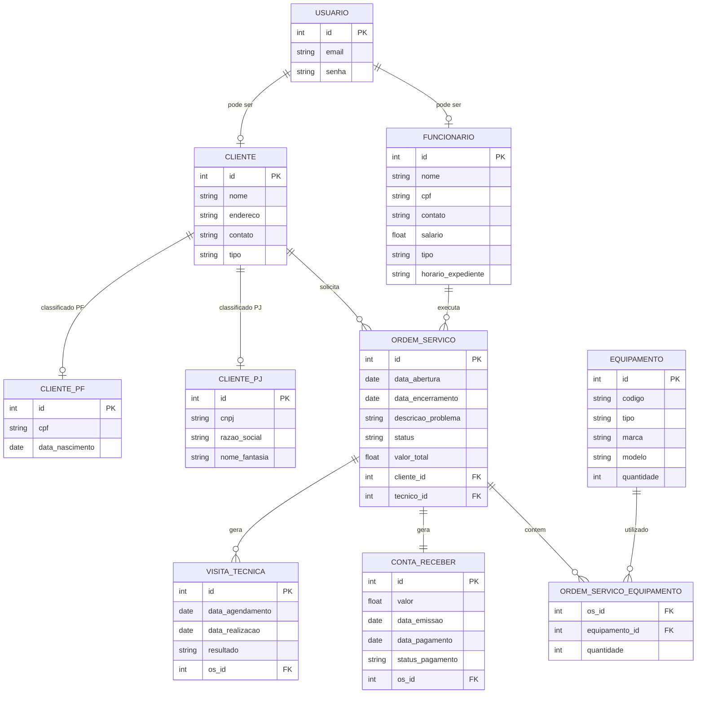

# Documento de Visão

## Descrição do Projeto

Título: Sistema de Gestão de Assistência Técnica

Descrição: O Sistema de Gestão de Assistência Técnica é uma aplicação web que tem como objetivo gerenciar clientes, ordens de serviço, equipamentos e visitas técnicas de forma organizada e eficiente. Ele permite cadastrar e acompanhar ordens de serviço, e gerar relatórios para facilitar o acompanhamento das atividades. O sistema oferece diferentes perfis de usuários, possa acessar as funcionalidades de acordo com suas permissões.

## Equipe e Definição de Papéis

Membro     |     Papel   |   E-mail   |
---------  | ----------- | ---------- |
Jadson    | --  | -- |
Mariana     | Analista, Desenvolvedor | araujodemedeirosmariana@gmail.com |

### Matriz de Competências

Membro     |     Competências   |
---------  | ----------- |
Jadson    | --  |
Mariana     | -- | 

## Perfis dos Usuários

O sistema poderá ser utilizado por diversos usuários. Temos os seguintes perfis/atores:

Perfil                                 | Descrição   |
---------                              | ----------- |
Cliente | Este usuário pode verificar suas ordens de serviço, consultar contas a receber e realizar pagamentos online de serviços concluídos.
Administrativo | Este usuário é responsável pela gestão do sistema, cadastro de informações, controle financeiro e registro de pagamentos recebidos fora do sistema.
Técnico | Este usuário é responsável pela execução dos serviços, atualização das ordens de serviço e registro de peças utilizadas.

## Lista de Requisitos Funcionais

### Entidade Cliente - RF01 - Manter Cliente
Um cliente representa uma pessoa ou empresa que utiliza os serviços da assistência técnica. Possui informações detalhadas como nome, endereço, contato, CPF e histórico de serviços.

Regra: Um cliente deve ser obrigatoriamente CPF ou CNPJ, não podendo ser ambos.

Requisito                     | Descrição   | Ator |
---------                     | ----------- | ---------- |
RF01.1 - Cadastrar Cliente    | Insere novo novo cliente informando: id, nome, endereço, contato, CPF. | Administrativo |
RF01.2 - Alterar Cliente      | Atualiza qualquer dado contido no cadastro do cliente, caso seja necessário. | Administrativo |
RF01.3 - Consultar Cliente   | Consulta do cliente através dos dados do mesmo. | Administrativo, Técnico |
RF01.4 - Desativar Cliente   | Desativar um cliente informando o id. | Administrativo |

---

### Entidade Funcionário - RF02 - Manter Funcionário
Um funcionário representa o usuário responsável pelas operações do sistema, classificados como: Técnico e Administrativo.

Requisito                     | Descrição   | Ator           |
---------                     | ----------- | ----------     |
RF02.1 - Cadastrar Funcionário | Insere novo funcionário informando: código, nome, CPF, cargo, salario, carteira, expendiente. | Administrativo |
RF02.2 - Alterar Funcionário | Atualiza um funcionário informando: código, nome, CPF, cargo, salario, carteira, expendiente. | Administrativo |
RF02.3 - Consultar Funcionário |  Consulta do funcionário através dos dados do mesmo. | Administrativo |
RF02.4 - Desativar Funcionário | Desativar um funcionário informando o id. | Administrativo |

---

### Entidade Ordem de Serviço - RF03 - Manter Ordem de Serviço
Uma ordem de serviço registra o atendimento realizado, podendo conter vários equipamentos e status de acompanhamento.

Requisito                     | Descrição   | Ator           |
---------                     | ----------- | ----------     |
RF03.1 - Abrir ordem de Serviço  | Criar de order de serviço para solicitação de reparo ou manutenção, incluir informações sobre o cliente, descrição do problema e quaisquer detalhes relevantes. | Administrador |
RF03.2 - Editar ordem de serviço | Atualiza uma OS informando:informações sobre o cliente, descrição do problema e quaisquer detalhes relevantes. | Administrador |
RF03.3 - Consultar ordem de serviço | Consulta uma OS informando: id. | Técnico, Administrador, cliente |
RF03.4 - Atualizar Status da OS         | Alterar o status da OS conforme andamento. | Técnico, Administrador |
RF03.5 - Encerrar ordem de serviço         | Encerramento da OS após a conclusão das atividades.  | Técnico |
RF03.6 - Emitir Relatório         | Gerar relatórios diversos, como histórico de serviços realizados, faturamento por período, entre outros.  | Técnico, Administrador |

---

### Entidade Equipamento  - RF04 - Manter Equipamento 
Um componente essencial ao realizar OS. Ele tem: código, tipo, marca, modelo, quantidade.

Requisito                     | Descrição   | Ator           |
---------                     | ----------- | ----------     |
RF04.1 - Cadastrar Equipamento   | Insere novo equipamento informando: código, tipo, marca, modelo, quantidade. | Administrador |
RF04.2 - Listar Equipamento   | Listagem dos equipamentos cadastrados. | Administrador, Técnico |
RF04.3 - Consultar Equipamento | Consultar equipamento informando: código, tipo, marca, modelo. | Administrador, Técnico |
RF04.4 - Desativar Equipamento   | Desativa um equipamento informando seu identificador. | Administrador |

---

### Entidade Visita Técnica - RF005 - Agendar Visitas Técnicas
Uma visita técnica representa um atendimento presencial vinculado a uma ordem de serviço.

Requisito                     | Descrição   | Ator           |
---------                     | ----------- | ----------     |
RF05.1 - Agendar Visitas Técnicas  | Funcionalidade que permite ao funcionário administrativo agendar visitas presenciais para resolver problemas que não podem ser resolvidos remotamente.  | Administrador |
RF05.2 - Registrar Realização da Visita	| Funcionalidade que permite ao técnico registrar a data e o resultado da visita.	|	Técnico |

---

### Entidade Registrar Conta Receber - RF006 - Registrar Conta Receber 
Ao salvar uma OS é criado um conta receber automaticamente, na qual possuir: id,valor, data de pagamento.

Requisito                     | Descrição   | Ator           |
---------                     | ----------- | ----------     |
RF06.1 - Registrar Conta Receber | Ao salvar uma OS é criado um conta receber automaticamente. | Sistema |
RF06.2 - Registrar Pagamento Offline | O sistema deve permitir que o funcionário administrativo registre pagamentos recebidos fora do sistema. |	Administrativo |

---

### Entidade Pagar Conta - RF007 - Pagar Conta
Permitir a funcionalidade ao cliente selecionar uma conta a pagar e com os detalhes do pagamento, incluindo o valor a ser pago, de forma conveniente e segura. 

Requisito                     | Descrição   | Ator                      |
---------                     | ----------- | ----------                |
RF07 - Pagar Conta        | Permitir a funcionalidade ao cliente selecionar uma conta a pagar | Cliente  |

---

### Modelo Conceitual

Abaixo apresentamos o modelo conceitual usando o **Mermaid**.

#### Descrição das Entidades

Entidade                          |	Descrição   |
---------                         | ----------- |
Usuário	   | Entidade base para autenticação, contendo credenciais de acesso (email e senha). |
Cliente	   | Entidade base para clientes, contendo atributos comuns a qualquer cliente (nome, endereço, contato). Possui uma especialização total e disjunta para CPF e CNPJ. |
Cliente PF	| Especialização da entidade Cliente. Armazena dados específicos de Pessoa Física: CPF e data de nascimento. |
Cliente PJ	| Especialização da entidade Cliente. Armazena dados específicos de Pessoa Jurídica: CNPJ, razão social e nome fantasia. |
Funcionário	 | Herda de Usuário. Armazena dados profissionais, diferenciando Técnico e Administrativo (especialização total e disjunta). |
Ordem de Serviço | Núcleo do sistema, registra cada solicitação de serviço, seu status, valor, e vincula cliente e técnico responsável. |
Equipamento	| Representa os itens que serão reparados ou utilizados nos serviços. |
Ordem de Serviço Equipamento | Tabela de relacionamento muitos-para-muitos entre OS e Equipamento. |
Visita Técnica | Vinculada a uma OS, registra agendamentos e realizações de atendimentos presenciais. |
Conta a Receber	| Gerada automaticamente ao encerrar uma OS, registra o valor a ser pago pelo cliente. |

## Lista de Requisitos Não-Funcionais

Requisito                                 | Descrição   |
---------                                 | ----------- |
RNF001 - Deve ser acessível via navegador | Deve abrir perfeitamento no Firefox e no Chrome. |
RNF002 - Disponibilidade do Sistema |O sistema deve estar disponível 24/7, com um tempo de inatividade mínimo para manutenção programada. |
RNF003 - Usabilidade | O sistema deverá possuir uma interface intuitiva e de fácil utilização, permitindo que usuários com pouca experiência em sistemas consigam utilizá-lo sem dificuldades significativas. |
RNF04 -	Segurança |	As senhas dos usuários devem ser armazenadas de forma criptografada (hash). O controle de acesso deve ser rigorosamente baseado nos perfis definidos. |

## Riscos

Data | Risco | Prioridade | Responsável | Status | Providência/Solução |
------ | ------ | ------ | ------ | ------ | ------ |
31/03/2026 | Mudança de escopo com inclusão de funcionalidades não planejadas durante o desenvolvimento. | Alta | Mariana | Monitorando	| Utilizar metodologia ágil com sprints curtas para priorizar entregas e congelar escopo a cada iteração. |
31/03/2026 | Indisponibilidade ou falha na integração com gateway de pagamento. | Média | Jadson | Monitorando | Pesquisar e ter um plano B com outro provedor de pagamento; implementar registro de falhas para retentativa. |
31/03/2026 | Dificuldade de adaptação dos usuários à nova ferramenta. |	Média |	Mariana | Monitorando |	Realizar treinamentos iniciais e produzir manuais de usuário simplificados. |

### Referências

MODELO BSI – Doc 001 – Documento de Visão. Documento construído a partir do modelo BSI. Disponível em: https://docs.google.com/document/d/1DPBcyGHgflmz5RDsZQ2X8KVBPoEF5PdAz9BBNFyLa6A/edit?usp=sharing
. Acesso em: 28 mar. 2026.
